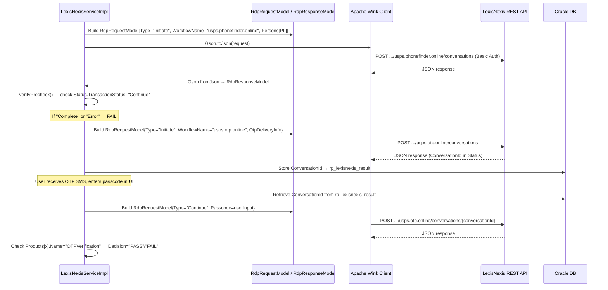
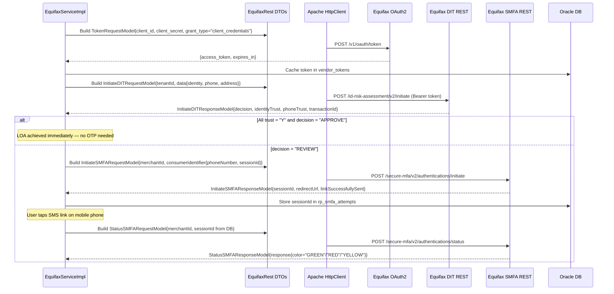
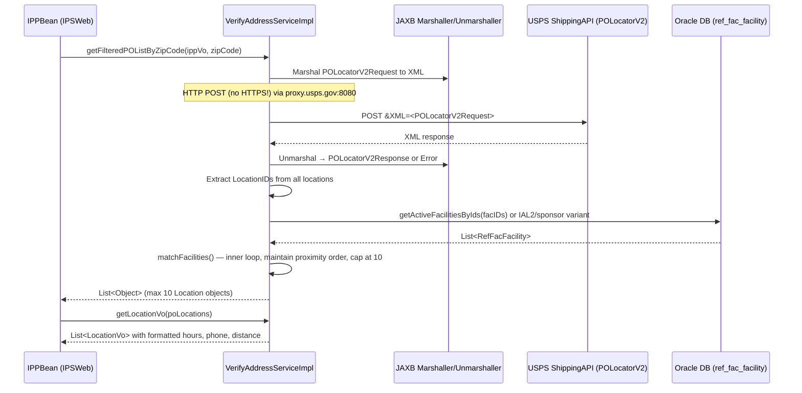

# POLocator + LexisNexisRDP + EquifaxIDFS + EquifaxRest — Integration Ecosystem Analysis
**Sources:** POLocator.zip, LexisNexisRDP.zip, EquifaxIDFS.zip, EquifaxRest.zip  
**Analysis date:** May 2026

---

## A. Executive Architecture Summary

These four modules are **pure integration adapter/DTO libraries** — they have no REST endpoints, no application logic, no Spring beans, and no database access of their own. Each is a JAR bundled into the main application WARs (IPSWeb, RemoteRest) and invoked by `IVSPersistence` service classes.

**The ecosystem role of each module:**

| Module | Pattern | Purpose |
|---|---|---|
| **POLocator** | Vendor Adapter + DB Service | Makes XML/HTTP calls to USPS Shipping APIs (POLocator, Address Verification, GIS Geocoder); queries the IVS facility database to filter results |
| **LexisNexisRDP** | DTO Library | Pure Java POJO models for serializing/deserializing JSON to/from LexisNexis Remote Data Proofing REST API conversations |
| **EquifaxIDFS** | SOAP Proxy + JAXB DTOs | JAX-WS generated proxy and JAXB-annotated model classes for calling the Equifax Identity Fraud Service (IDFS) SOAP endpoint |
| **EquifaxRest** | DTO Library | Pure Java POJO models for serializing/deserializing JSON to/from Equifax DIT (Digital Identity Trust) REST and SMFA (Secure MFA) REST APIs; includes OAuth2 token request model |

**What connects them:** All four are consumed exclusively by `IVSPersistence` proofing service classes — specifically `EquifaxServiceImpl`, `LexisNexisServiceImpl`, and `VerifyAddressServiceImpl` — which use Gson and Apache Wink/HttpClient to marshal/unmarshal these DTOs against vendor endpoints.

---

## B. Module-by-Module Breakdown

### Module 1: POLocator

**Business purpose:** Enables citizens to find nearby USPS Post Offices that offer In-Person Proofing (IPP) services. Validates and standardizes addresses using USPS Address Management System (AMS). Geocodes addresses for distance calculation.

**Role:** Vendor Adapter + Database Service JAR

**What it does (runtime behavior):**

1. **Address Verification** (`verifyAddress()`): Calls USPS Shipping API `GetAddress` endpoint via raw HTTP `URLConnection` over proxy `proxy.usps.gov:8080`. Marshals a `GetAddressRequestType` to XML using JAXB, POSTs `&XML=<payload>` as form data, unmarshals `GetAddressResponseType` from the XML response. If status is `"EXACT MATCH"`, returns the standardized address. Then calls the GIS Geocoder to get lat/long.

2. **PO Location Search** (`getFilteredPOList()`, `getFilteredPOListByZipCode()`): Calls USPS Shipping API `POLocatorV2` endpoint via same raw HTTP pattern. Builds a `POLocatorV2Request` with radius=50 miles, maxLocations=100, facilityType=`"PO"`, service=`"PICKUPHOLDMAIL"`. Unmarshals `POLocatorV2Response` or `Error` object.

3. **Facility DB Cross-reference** (`getPOLocatorResponse()`): Takes the PO Locator results and cross-references against the IVS `ref_fac_facility` table using `RefFacFacilityService`. Filters the list of 100 raw PO Locator results down to max 10 IVS-registered facilities, maintaining proximity order. The filtering strategy varies by sponsor context:
   - **IAL2 with sublist**: `getIAL2FacilitiesSublist(facIDs, sponsorId)`
   - **IAL2 without sublist**: `getIAL2Facilities(facIDs, sponsorId)`
   - **CustReg sponsor or no sublist**: `getActiveFacilitiesByIds(facIDs)`
   - **Active IPP client with sublist**: `findActiveSponsorFacilitiesByIds(sponsorId, facIDs)`

4. **Geocoordinate Population** (`populateGeocoordinates()`): Scheduled job (Quartz, daily 00:15) that finds all `ref_fac_facility` rows with null lat/long, calls PO Locator for each, and updates the coordinates in the DB via `refFacFacilityService.update()`.

**Key constants hardcoded:**
- `WEB_TOOLS_API_GETADDRESS = "http://production.shippingapis.com/ShippingAPI.dll?API=GetAddress"` — **HTTP, not HTTPS**; a hardcoded production URL that overrides whatever is in `ips.properties`
- `WEB_TOOLS_API_POLOCATOR = "http://production.shippingapis.com/ShippingAPI.dll?API=POLocatorV2"` — same
- `USPS_PROXY_HOST = "proxy.usps.gov"` / `USPS_PROXY_PORT = "8080"` — hardcoded, cannot be overridden
- `WEB_TOOLS_API_POLOCATOR_RADIUS = "50"` (miles), `MAXLOCATIONS = "100"`, `FACILITYTYPE = "PO"`, `SERVICE = "PICKUPHOLDMAIL"`

**Static initializer risk:** `VerifyAddressServiceImpl` has a `static {}` block that runs at class load time — before Spring context is fully initialized in some cases — and calls `Utils.getAppCredentials(IPSPOLocatorConstants.WEB_TOOLS_ALIAS)` to fetch the J2C alias `"AMS"` from WebSphere. If this throws `IPSException`, `username` remains null and all subsequent address verification calls will send null as the USERID, silently producing incorrect responses.

**Database tables touched (read/write):**
- `ref_fac_facility` — READ heavily; WRITE during geocoordinate job
- `ref_main_facility` — READ (via `RefMainFacilityService`)
- `ref_area` — READ (via `RefAreaService`)
- `ref_district` — READ (via `RefDistrictService`)
- `ref_device_types` — READ (via `RefDeviceTypesService`)

---

### Module 2: LexisNexisRDP

**Business purpose:** Provides the DTO/model layer for all communications with the LexisNexis Remote Data Proofing (RDP) REST API — including identity verification workflows (PhoneFinder, OTP), device reputation assessment (ThreatMetrix-based), and ThreatMetrix direct query.

**Role:** Pure DTO Library (no services, no Spring beans, no HTTP logic)

**Package:** `com.lexisnexis.ns.identity_proofing._1`

**Model inventory and purpose:**

| Model Class | Used In | Purpose |
|---|---|---|
| `RdpRequestModel` | PhoneFinder, OTP, all RDP workflows | Root request container — holds `Type`, `Settings`, `Persons`, `Answers`, `OtpDeliveryInfo`, `Passcode`, `CustomData` |
| `RdpResponseModel` | All LexisNexis responses | Root response — holds `Status` (conversation/transaction metadata) + `Products` (per-product results) + `Information` (OTP details) |
| `RdpStatusModel` | Response parsing | Contains `ConversationId`, `RequestId`, `TransactionStatus`, `ActionType`, `LexID`, `TransactionReasonCode` — the critical fields for workflow routing |
| `RdpSettingsModel` | All requests | Workflow settings including `WorkflowName` (e.g., `USPS_LOA15_B2B_FLOW`) and pass-through parameters |
| `RdpPersonModel` | Identity workflows | Person PII: `Name`, `Address`, `Phone`, `DateOfBirth`, `SSN` |
| `OTPDeliveryInfoModel` | OTP workflow | Delivery channel config: phone number, OTP type |
| `OTPInformationModel` | OTP response parsing | OTP information in response: `InformationType`, `Code`, `Description`, `DetailDescription` — used to detect OTP status |
| `OTPValuesModel` | OTP response | Contains OTP details like expiry |
| `RdpDeviceAssessmentRequestModel` | Device reputation | Device assessment request with `DeviceAssessment`, `Persons`, `Businesses`, `CustomerIpAddress` |
| `RdpDeviceAssessmentResponseModel` | Device reputation | Device result model |
| `RdpDeviceAssessmentModel` | Device requests | Holds `SessionID` (the ThreatMetrix profiling session ID) |
| `RdpPassThroughModel` | BCG/CoA | Used for multi-product bundled assessments (device + email) |
| `RdpPassThroughResponseModel` | BCG/CoA response | Bundled assessment response |
| `RdpTmxVariablesModel` + `RdpTmxReasonCodesModel` | TMX enrichment | ThreatMetrix variables and reason codes in the response |
| `TmxQueryRequestModel` | TMX direct query | Direct ThreatMetrix API query: `account_email`, `api_key`, `org_id`, `action`, `service_type` |
| `TmxQueryResponseModel` | TMX direct query response | ThreatMetrix query response |
| `RdpProductModel` + `RdpProductItemModel` | Response parsing | Per-product result entries in the response array |
| `RdpReasonCodeModel` + `RdpReasonCodesModel` | Reason code mapping | LexisNexis reason codes (e.g., `RI`, `ET`, `CZ`) |
| `RdpTransactionException` + `RdpProductException` | Exception handling | Typed exceptions for LexisNexis transaction-level and product-level errors |
| `SMSCustomDataModel` | OTP request | Custom data for SMS delivery (e.g., `smsUrl`, `targetUrl` for mobile OTP) |

**How consumed (in `LexisNexisServiceImpl` in IVSPersistence):**
1. Build `RdpRequestModel` → set `Type`, `Settings.WorkflowName`, populate `Persons` with PII
2. Serialize to JSON via `Gson.toJson()`
3. POST to LexisNexis REST URL via Apache Wink `Client.resource(url).post(json)`
4. Deserialize response via `Gson.fromJson(responseBody, RdpResponseModel.class)`
5. Check `response.getStatus().getTransactionStatus()` — values like `"Continue"`, `"Complete"`, `"Error"`
6. Check `response.getStatus().getActionType()` — values like `"VerifyOTP"`, `"IntroduceOTP"`, `"VerifyPhone"`
7. For OTP workflows: extract `ConversationId` from `Status`, store in DB for subsequent calls

---

### Module 3: EquifaxIDFS

**Business purpose:** Provides the SOAP client proxy and JAXB-annotated model classes for calling the Equifax Identity Fraud Service (IDFS) — the older SOAP-based identity verification and OTP phone verification endpoint.

**Role:** JAX-WS SOAP Proxy + JAXB DTO Library

**Package structure:**
- `com.equifax.eid.soap.schema.identityfraudservice.v2` — core identity fraud service types (shared base)
- `com.equifax.eid.soap.schema.usidentityfraudservice.v2` — US-specific IDFS types and the proxy

**SOAP operations exposed:**

| SOAP Method | Request | Response | Purpose |
|---|---|---|---|
| `submit()` | `InitialRequest` | `InitialResponse` | First call — sends identity + device context, returns `transactionKey` + initial OTP decision |
| `resubmit()` | `SubsequentRequest` | `SubsequentResponse` | Second call — sends OTP passcode, returns final decision |
| `poll()` | `PollRequest` | `PollResponse` | Polls for async transaction status |

**Key JAXB model classes:**

| Class | Key Fields | Purpose |
|---|---|---|
| `InitialRequest` | `OrchestrationCode`, `Identity`, `Employment`, `Biometrics`, `Device`, `AuxiliaryData`, `ProcessingOptions` | First SOAP call payload. `OrchestrationCode` controls the product mix (e.g., `"eidphone"` for phone verify, `"otponly"` for OTP resend) |
| `InitialResponse` | `transactionKey` (attribute), `transactionStatus`, `ProductResponses`, `EquifaxKey`, `ReferenceData`, `Error` | Contains `transactionKey` — stored in `rp_otp_attempts.transaction_key` for the `resubmit()` call |
| `SubsequentRequest` | `transactionKey` (required), `Identity`, `QuizAnswers`, `OneTimePasscodeInput` | The confirm-passcode call — `transactionKey` must match what was returned in `InitialResponse` |
| `SubsequentResponse` | `transactionKey`, `transactionStatus`, `ProductResponses` | Final decision after passcode confirmation |
| `Identity` | `Name`, `Address`, `PhoneNumber`, `DateOfBirth`, `SSN`, `DriversLicense` | PII container for IDFS calls |
| `DynamicOTP` | `Decision`, `Passcode`, `NumberOfRenewRequests`, `Attempts`, `productStatus` | OTP-specific product result inside `ProductResponses` — `Decision` values: `"PASS"`, `"FAIL"`, `"PENDING"` |
| `OverallAssessment` | `Decision`, `Details` | Overall identity assessment result |
| `PhoneVerification` | `PhoneNumber`, `OverAllMatchQuality`, `PhoneConfirmationType` | Phone-specific result |
| `TransactionStatus` | (enum) `"Approved"`, `"Denied"`, `"Pending"` | Top-level transaction outcome |
| `ProductResponses` | `IdentityVerification`, `ProofingAssessment`, `GenericProductAssessment` | Container for all product results |

**Proxy resolution logic:** `UsIdentityFraudServiceHttpPortProxy` first tries JNDI lookup `java:comp/env/service/usIdentityFraudServiceV2` (WebSphere-managed service reference). If that fails, falls back to constructing `UsIdentityFraudServiceV2` directly (loads the WSDL from classpath). The actual endpoint URL is then overridden at runtime via `BindingProvider.ENDPOINT_ADDRESS_PROPERTY` — the endpoint is set from `ips.properties` by `EquifaxServiceImpl`.

**Authentication:** WS-Security UsernameToken header is added programmatically by `EquifaxServiceImpl` before each SOAP call using credentials from WebSphere J2C alias `"EquifaxIDFS"`.

---

### Module 4: EquifaxRest

**Business purpose:** Provides the DTO/model layer for two Equifax REST APIs: DIT (Digital Identity Trust — phone verification + silent authentication) and SMFA (Secure MFA — SMFA link delivery to mobile phones). Also provides the OAuth2 token request model.

**Role:** Pure DTO Library

**Package structure:**
- `com.equifax.common` — shared OAuth2 token request model and error detail model
- `com.equifax.dit.request` / `.response` — DIT initiation DTOs
- `com.equifax.smfa.request` / `.response` — SMFA initiation and status DTOs

**DIT (Digital Identity Trust) flow models:**

| Class | Key Fields | Purpose |
|---|---|---|
| `TokenRequestModel` | `client_id`, `client_secret`, `grant_type`, `scope` | OAuth2 `client_credentials` token request body |
| `InitiateDITRequestModel` | `tenantId`, `applicationId`, `referenceId`, `consumerId`, `correlationId`, `productId`, `configId`, `entityId`, `data` | DIT initiate payload — `data` contains identity + phone data |
| `DataModel` | `identity` (`IdentityModel`), `phone` (`PhoneModel`), `address` (`AddressModel`), `email` (`EmailModel`), `governmentId`, `additionalFields` | PII container inside DIT request |
| `IdentityModel` | `name` (`NameModel`), `dateOfBirth` (`DateOfBirthModel`) | Identity sub-model |
| `NameModel` | `first`, `last`, `middle`, `suffix` | Name breakdown |
| `DateOfBirthModel` | `year`, `month`, `day` | DOB breakdown |
| `AddressModel` | `line1`, `line2`, `city`, `state`, `zip`, `zip4`, `country` | Address sub-model |
| `PhoneModel` | `number`, `type`, `country` | Phone number (10 digits, no dashes) |
| `InitiateDITResponseModel` | `transactionId`, `correlationId`, `decision`, `overallDecision`, `identityTrust`, `addressTrust`, `phoneTrust`, `phoneVerification`, `status`, `fault`, `details` | DIT response — `decision` drives routing; `identityTrust`/`phoneTrust` flags used for "all-trust" check |
| `DetailModel` | (not inspected) | Per-product detail results |
| `FaultModel` + `FaultDetailModel` | `code`, `message`, `details` | Error details when DIT returns non-200 |

**SMFA (Secure MFA) flow models:**

| Class | Key Fields | Purpose |
|---|---|---|
| `InitiateSMFARequestModel` | `merchantId`, `usecase`, `consumerIdentifier` | SMFA initiate payload — sends the SMFA link to the user's phone |
| `ConsumerIdentifierModel` | `phoneNumber`, `sessionId` | Phone number target for SMFA link |
| `StatusSMFARequestModel` | `merchantId`, `usecase`, `consumerIdentifier` | SMFA status poll payload — checks if user tapped the link |
| `InitiateSMFAResponseModel` | `transactionId`, `sessionId`, `redirectUrl`, `instaTouch`, `linkSuccessfullySent`, `otpLifecycle`, `efxErrorCode`, `description` | SMFA initiate response — `redirectUrl` is the link sent to user's phone; `sessionId` stored for status polling |
| `OtpLifecycleModel` | (not fully inspected) | OTP lifecycle timing data |
| `StatusSMFAResponseModel` | `transactionId`, `response` (`ResponseStatusModel`), `efxErrorCode`, `description` | SMFA status response |
| `ResponseStatusModel` | `color`, `description` | The key SMFA validation result — `color` values: `"GREEN"` (passed), `"RED"` (failed), `"YELLOW"` (pending) |

---

## C. Technology Stack Inventory

| Item | POLocator | LexisNexisRDP | EquifaxIDFS | EquifaxRest |
|---|---|---|---|---|
| **Java** | 8+ | 8+ | 8+ | 8+ |
| **Build** | Gradle | Gradle | Gradle | Gradle |
| **Spring** | Spring `@Service`, `@Autowired`, `@Transactional`, `RestTemplate` | None | None | None |
| **JPA/ORM** | EclipseLink (via IVSPersistence base classes) | None | None | None |
| **HTTP Client** | `java.net.URLConnection` (raw), Spring `RestTemplate` (GIS) | None (caller uses Wink) | JAX-WS `javax.xml.ws.*` | None (caller uses HttpClient) |
| **XML/JSON** | JAXB (`javax.xml.bind`) | None (caller uses Gson) | JAXB `@XmlElement`, `@XmlAttribute`, `@XmlRootElement` | None (caller uses Gson/Jackson) |
| **SOAP** | None | None | JAX-WS (`@WebService`, `@SOAPBinding`, WSDL) | None |
| **Logging** | `CustomLogger` wrapper around Log4j2 | None | None | None |
| **DI** | Spring `@Service`, `@Autowired` | None | None | None |
| **Transactions** | Spring `@Transactional` on `RefFacFacilityServiceImpl` | None | None | None |
| **Proxy** | `java.net.Proxy` (HTTP, `proxy.usps.gov:8080`) hardcoded | N/A | N/A | N/A |

---

## D. REST/API Inventory

**None of these four modules expose REST endpoints.** They are consumed internally by IVSPersistence.

The **external vendor APIs** they interact with:

| API | Type | POLocator | LexisNexisRDP | EquifaxIDFS | EquifaxRest |
|---|---|---|---|---|---|
| USPS ShippingAPI `GetAddress` | HTTP XML POST | ✅ calls | — | — | — |
| USPS ShippingAPI `POLocatorV2` | HTTP XML POST | ✅ calls | — | — | — |
| USPS GIS Geocoder | HTTP REST GET | ✅ calls | — | — | — |
| LexisNexis RDP conversations | HTTPS REST POST | — | ✅ DTOs | — | — |
| LexisNexis ThreatMetrix query | HTTPS REST GET | — | ✅ DTOs | — | — |
| Equifax IDFS `usidentityfraudservicev2` | HTTPS SOAP | — | — | ✅ proxy | — |
| Equifax OAuth2 token | HTTPS REST POST | — | — | — | ✅ DTOs |
| Equifax DIT `id-risk-assessment/v2/initiate` | HTTPS REST POST | — | — | — | ✅ DTOs |
| Equifax SMFA `secure-mfa/v2/authentications/initiate` | HTTPS REST POST | — | — | — | ✅ DTOs |
| Equifax SMFA `secure-mfa/v2/authentications/status` | HTTPS REST POST | — | — | — | ✅ DTOs |

---

## E. Service Layer Inventory

### POLocator Services

| Service | Responsibility | Key Methods |
|---|---|---|
| `VerifyAddressServiceImpl` | Core service — address verification, PO location search, geocoding, facility coordinate population | `verifyAddress()`, `getFilteredPOList()`, `getFilteredPOListByZipCode()`, `getLocationVo()`, `populateGeocoordinates()` |
| `RefFacFacilityServiceImpl` | CRUD + query operations for `ref_fac_facility` | `getActiveFacilitiesByIds()`, `findActiveSponsorFacilitiesByIds()`, `getIAL2Facilities()`, `getIAL2FacilitiesSublist()`, `findFacilitiesInGrid()`, `populateGeocoordinates()`, `update()` |
| `RefAreaServiceImpl` | CRUD for `ref_area` | Standard CRUD |
| `RefDistrictServiceImpl` | CRUD for `ref_district` | Standard CRUD |
| `RefDeviceTypesServiceImpl` | CRUD for `ref_device_types` | Standard CRUD |
| `RefMainFacilityServiceImpl` | CRUD for `ref_main_facility` | Standard CRUD + staging data operations |

---

## F. Major Business Workflows

### Workflow 1 — IPP Post Office Search (POLocator)

**Entry point:** `IPPBean.searchByZipCode()` in IPSWeb → `VerifyAddressService.getFilteredPOListByZipCode()`

```
User enters ZIP → IPPBean.searchByZipCode()
    ↓
VerifyAddressService.getFilteredPOListByZipCode(ippVo, zipCode)
    ↓
VerifyAddressServiceImpl.getPoLocationsByZipCode(ippVo, zipCode)
    ├─ Build POLocatorV2Request:
    │   - USERID = J2C alias "AMS" username
    │   - Revision = "2"
    │   - ResponseDetail = "ALL"
    │   - ZIP5 = userInput
    │   - Radius = "50" (miles)
    │   - MaxLocations = "100"
    │   - FacilityType = "PO"
    │   - Service = "PICKUPHOLDMAIL"
    ├─ Marshal to XML via JAXB
    ├─ POST "&XML=<payload>" to http://production.shippingapis.com/ShippingAPI.dll?API=POLocatorV2
    │   via proxy.usps.gov:8080 (hardcoded, no HTTPS)
    └─ Unmarshal response → POLocatorV2Response OR Error
    ↓
getPOLocatorResponse(ippVo, resultList)
    ├─ Extract all LocationIDs from POLocatorV2Response
    ├─ Cross-reference against ref_fac_facility DB:
    │   [IAL2 + sublist] → getIAL2FacilitiesSublist(facIDs, sponsorId)
    │   [IAL2 no sublist] → getIAL2Facilities(facIDs, sponsorId)
    │   [CustReg/no sublist] → getActiveFacilitiesByIds(facIDs)
    │   [IPP sponsor + sublist] → findActiveSponsorFacilitiesByIds(sponsorId, facIDs)
    └─ matchFacilities(): Inner loop — maintains PO Locator proximity order,
       returns up to 10 matching IVS-registered facilities
    ↓
IPPBean displays list to user (max 10, sorted closest first)
```

**Failure modes:**
- POLocatorV2 returns `Error` object → logged, returned as-is → calling JSF bean shows generic error
- USPS ShippingAPI unreachable → `AMSException` thrown → calling bean shows error
- DB query returns empty list → empty `List<Object>` → no facilities shown to user

---

### Workflow 2 — Address Verification (POLocator)

**Entry point:** `IPPBean.checkForObjects()` → `VerifyAddressService.verifyAddress(appointment)`

```
User selects facility → verifyAddress(appointment)
    ├─ Build GetAddressRequestType:
    │   - USERID = J2C alias "AMS" username
    │   - Revision = "2"
    │   - Address1, Address2, City, State, Zip5, Zip4
    ├─ Marshal to XML via JAXB
    ├─ POST "&XML=<payload>" to http://production.shippingapis.com/ShippingAPI.dll?API=GetAddress
    │   via proxy (no HTTPS)
    └─ Unmarshal GetAddressResponseType
    ↓
Check rsp.getAddressStatus():
    "EXACT MATCH" → standardize address from response, rebuild AppointmentVo
    else → throw AMSException("Address Status is " + status)
    ↓
If not IPP type "F" (facility) → getGisGeocoderCoordinates(appointment)
    ├─ Build URL: geocoderUrlGis (from ips.properties) with street/city/state/zip params
    ├─ Spring RestTemplate.getForObject() via proxy
    └─ Parse JSON candidates array → take first result's x (longitude) and y (latitude)
    ↓
Return AppointmentVo with standardized address + lat/long
```

---

### Workflow 3 — LexisNexis Phone Verification + OTP (LexisNexisRDP)

**Entry point:** `LexisNexisServiceImpl.verifyPhone()` in IVSPersistence

```
Step 1 — PhoneFinder: Build RdpRequestModel
    ├─ Type = "Initiate"
    ├─ Settings.WorkflowName = "usps.phonefinder.online" (from ips.properties)
    ├─ Persons[0] = { Name, Address, Phone, DateOfBirth }
    └─ CustomData[0] = { SMSCustomDataModel: smsUrl, targetUrl }
    ↓
Serialize → Gson.toJson(request)
POST to https://staging.ws.idms.lexisnexis.com/.../usps.phonefinder.online/conversations
    or https://ws.idms.lexisnexis.com/.../usps.phonefinder.online/conversations (prod)
    via Apache Wink client, Basic Auth from J2C alias "LexisNexis"
    ↓
Deserialize → Gson.fromJson(body, RdpResponseModel.class)
    ├─ Check Status.TransactionStatus:
    │   "Continue" → precheck passed → proceed to OTP workflow
    │   "Complete"/"Error" → precheck failed → FAIL path
    ├─ Check Status.ActionType: "IntroduceOTP" means OTP delivery pending
    └─ verifyPrecheck(): Analyzes Products list for PhoneFinder result

Step 2 — OTP Workflow: Build RdpRequestModel
    ├─ Type = "Initiate"
    ├─ Settings.WorkflowName = "usps.otp.online"
    ├─ Persons[0] = same PII
    └─ OtpDeliveryInfo = { phone, deliveryMethod = "SMS" }
    ↓
POST to .../usps.otp.online/conversations
    ↓
RdpResponseModel:
    ├─ Status.ConversationId → stored in rp_lexisnexis_result.conversation_id (for confirmPasscode)
    ├─ Status.TransactionStatus = "Continue" → OTP sent
    └─ Information[0].Code → OTP delivery info

Step 3 — Confirm Passcode: Build RdpRequestModel
    ├─ Type = "Continue"  (NOT "Initiate")
    ├─ Settings.WorkflowName = "usps.otp.online"
    ├─ Passcode = userEnteredPasscode
    └─ ConversationId from DB (appended to URL: .../conversations/{conversationId})
    ↓
POST to .../usps.otp.online/conversations/{conversationId}
    ↓
RdpResponseModel:
    ├─ Status.TransactionStatus = "Complete" → final
    └─ Products[x].Name = "OTPVerification" → check Decision: "PASS"/"FAIL"
```

---

### Workflow 4 — Equifax IDFS SOAP (Phone Verify + OTP)

**Entry point:** `EquifaxServiceImpl.verifyPhoneWithEquifaxIDFS()` in IVSPersistence

```
Step 1 — Initial SOAP Call (submit):
    Build InitialRequest:
        ├─ OrchestrationCode = "eidphone" (from ips.properties, maps to Phone+OTP product)
        ├─ Identity:
        │   ├─ Name { first, last, middle }
        │   ├─ Address { street, city, state, zip }
        │   ├─ PhoneNumber { phoneNumber }
        │   └─ DateOfBirth { month, day, year }
        ├─ Device { deviceSessionId (ThreatMetrix session ID) }
        └─ ProcessingOptions.Aggregator { OrganizationCode="ips", OrchestrationCode="mypost" }
    ↓
Add WS-Security UsernameToken header (J2C alias "EquifaxIDFS")
Override endpoint URL from ips.properties (IDFS endpoint)
proxy.submit(initialRequest) → SOAP call to Equifax IDFS
    ↓
InitialResponse:
    ├─ transactionKey → stored in rp_otp_attempts.transaction_key
    ├─ transactionStatus → "Approved" (phone verified) or "Pending" (need OTP)
    └─ ProductResponses.DynamicOTP.Decision → "PASS"/"PENDING"

Step 2 — Send Passcode (resubmit, OrchestrationCode = "otponly"):
    Build SubsequentRequest:
        ├─ transactionKey from InitialResponse
        └─ (no passcode in this call — triggers OTP send on Equifax side)
    proxy.resubmit(subsequentRequest) → SOAP call
    ↓
SubsequentResponse:
    └─ DynamicOTP status → confirms OTP was sent

Step 3 — Confirm Passcode (resubmit with OneTimePasscodeInput):
    Build SubsequentRequest:
        ├─ transactionKey from DB (rp_otp_attempts)
        └─ OneTimePasscodeInput { passcode = userInput }
    proxy.resubmit(subsequentRequest) → SOAP call
    ↓
SubsequentResponse:
    └─ DynamicOTP.Decision = "PASS"/"FAIL"
    └─ OverallAssessment.Decision = "APPROVED"/"DENIED"
```

---

### Workflow 5 — Equifax DIT + SMFA (EquifaxRest)

**Entry point:** `EquifaxServiceImpl.verifyPhoneWithEquifaxDIT()` then optionally `sendSmfaLink()`

```
Step 1 — Get OAuth2 Token:
    TokenRequestModel:
        ├─ client_id = from ips.properties ("Equifax2" J2C or ips.properties)
        ├─ client_secret = from ips.properties
        ├─ grant_type = "client_credentials"
        └─ scope = (depends on product)
    POST to https://api.uat.equifax.com/v1/oauth/token
    Response: { access_token, token_type, expires_in }
    Token cached in vendor_tokens table

Step 2 — DIT Initiate:
    InitiateDITRequestModel:
        ├─ tenantId, applicationId, configId (from ips.properties or RefSponsorConfiguration)
        ├─ referenceId = IPS transaction ID
        ├─ consumerId = CustReg userId
        └─ data: { identity, phone, address, email }
            ├─ IdentityModel: { name { first, last }, dateOfBirth { year, month, day } }
            ├─ PhoneModel: { number (10 digits), type = "MOBILE", country = "US" }
            └─ AddressModel: { line1, city, state, zip, country }
    POST to https://api.uat.equifax.com/business/id-risk-assessment/v2/initiate
    Authorization: Bearer {accessToken}
    ↓
InitiateDITResponseModel:
    ├─ transactionId → stored in rp_event
    ├─ decision = "APPROVE"/"DENY"/"REVIEW"
    ├─ overallDecision
    ├─ identityTrust, addressTrust, phoneTrust, phoneVerification
    └─ fault (if error)

    If decision = "APPROVE" AND identityTrust="Y" AND phoneTrust="Y" → immediate APPROVED (no OTP needed)
    If decision = "REVIEW" → send SMFA link

Step 3 — SMFA Initiate (send link):
    InitiateSMFARequestModel:
        ├─ merchantId (from config)
        ├─ usecase = "IVS_PROOFING"
        └─ consumerIdentifier: { phoneNumber, sessionId (DIT transactionId) }
    POST to https://api.uat.equifax.com/business/secure-mfa/v2/authentications/initiate
    ↓
InitiateSMFAResponseModel:
    ├─ sessionId → stored in rp_smfa_attempts.session_id
    ├─ redirectUrl → the secure link sent to user's mobile phone via SMS
    ├─ linkSuccessfullySent → boolean flag
    └─ efxErrorCode → error codes: "20005" (landline), "20010" (422 failure), etc.

Step 4 — SMFA Status Poll (user tapped link?):
    StatusSMFARequestModel:
        ├─ merchantId
        ├─ usecase
        └─ consumerIdentifier: { phoneNumber, sessionId from DB }
    POST to https://api.uat.equifax.com/business/secure-mfa/v2/authentications/status
    ↓
StatusSMFAResponseModel:
    └─ response.color:
        "GREEN" → user tapped link, verified → LOA achieved
        "RED" → failed/declined
        "YELLOW" → still pending, poll again
```

---

## G. Vendor/Provider Integration Analysis

### LexisNexis RDP — Key Integration Points

| Aspect | Detail |
|---|---|
| **Protocol** | HTTPS REST (conversations API) |
| **Auth** | HTTP Basic Auth from J2C alias `"LexisNexisRDP"` |
| **HTTP client** | Apache Wink `Client.resource(url).accept(MediaType.APPLICATION_JSON).post(json)` |
| **Serialization** | Gson for both request and response |
| **URL pattern** | `{base}/accounts/{accountId}/workflows/{workflowName}/conversations[/{conversationId}]` |
| **Conversation IDs** | Must be stored in `rp_lexisnexis_result` after initial call; retrieved from DB for subsequent calls |
| **Error handling** | `RdpTransactionException` and `RdpProductException` thrown by caller; no retry logic in DTOs |
| **Timeout** | Not clear from code — not configured in these modules |
| **Status values** | `TransactionStatus`: `"Continue"`, `"Complete"`, `"Error"` |
| **Action types** | `ActionType`: `"IntroduceOTP"`, `"VerifyOTP"`, `"VerifyPhone"` |

**LexisNexis workflow names used (from `ips.properties`):**
- `usps.phonefinder.online` — PhoneFinder
- `usps.otp.online` — OTP delivery and confirmation
- `usps.device.online` — Device reputation (production)
- `usps.device.nodisco.test.wf` — Device reputation (non-prod)
- `usps.informed.delivery.wf` — Informed Delivery device workflow
- `usps.hold.mail.wf` — Hold Mail device workflow
- `usps.change.address.wf` — Change of Address device workflow
- `usps.da.era.prodwf` / `usps.da.era.stg.wf` — Business Customer Gateway
- `usps.trueid.wf.stg` / `{workflowname}` — TrueID (not clear which workflow name in production)

### Equifax IDFS — Key Integration Points

| Aspect | Detail |
|---|---|
| **Protocol** | HTTPS SOAP (JAX-WS) |
| **Auth** | WS-Security UsernameToken header from J2C alias `"EquifaxIDFS"` |
| **Endpoint** | `ifs-uat.us.equifax.com/uru/soap/ut/usidentityfraudservicev2` (non-prod) / `ifs.us.equifax.com/...` (prod) |
| **JNDI fallback** | Tries `java:comp/env/service/usIdentityFraudServiceV2` first; falls back to classloader WSDL |
| **Orchestration codes** | `"eidphone"` (phone verify + OTP), `"otponly"` (OTP resend/confirm), `"mypost"` (org level), `"idproofing"` (LOA2) |
| **Transaction key** | Returned in `InitialResponse.transactionKey`; must be provided in all subsequent `resubmit()` calls |
| **SOAP faults** | `CredentialsErrorFault`, `InvalidTransactionKeyFault`, `ValidationErrorFault` — distinct exception types |
| **Timeout** | Not configured in these modules — relies on JAX-WS defaults |

### Equifax DIT + SMFA — Key Integration Points

| Aspect | Detail |
|---|---|
| **Protocol** | HTTPS REST with Bearer token (OAuth2 `client_credentials`) |
| **OAuth token** | Cached in `vendor_tokens` table; refreshed when expired |
| **DIT decision values** | `"APPROVE"`, `"DENY"`, `"REVIEW"` — `REVIEW` triggers SMFA |
| **Trust flags** | `identityTrust`, `addressTrust`, `phoneTrust`, `phoneVerification` — all `"Y"/"N"` |
| **SMFA color codes** | `"GREEN"` = pass, `"RED"` = fail, `"YELLOW"` = pending |
| **SMFA error codes** | `"20005"` = landline (no SMS possible), `"20010"` = 422 failure, `null` = success |
| **linkSuccessfullySent** | Boolean field on `InitiateSMFAResponseModel` — but the calling code ALSO checks `efxErrorCode` for non-zero codes |
| **Session ID** | Returned by SMFA initiate → stored in DB → used for status poll |
| **Timeout** | Not configured in these modules |

### POLocator — Key Integration Points

| Aspect | Detail |
|---|---|
| **Protocol** | HTTP (not HTTPS) form-POST with `&XML=` query parameter |
| **Auth** | USPS USERID from J2C alias `"AMS"` — embedded in XML payload |
| **Proxy** | `proxy.usps.gov:8080` — hardcoded, no override possible |
| **Serialization** | JAXB (both request and response) |
| **GIS geocoder** | HTTP REST GET via Spring `RestTemplate` with proxy |
| **Hardcoded production URLs** | `IPSPOLocatorConstants` overrides whatever `ips.properties` says |
| **Error response type** | `Error` JAXB object distinct from `POLocatorV2Response` — unmarshal tries both; caller checks type |
| **No retry** | If call fails, `AMSException` is thrown immediately to the caller |
| **Facility list cap** | Results capped at 10 in `matchFacilities()` |

---

## H. Database Interaction Analysis

### POLocator Module Tables

| Table | Operations | Notes |
|---|---|---|
| `ref_fac_facility` | READ (multiple complex queries), WRITE (geocoordinate update) | Most heavily-used; has 20+ distinct query methods |
| `ref_main_facility` | READ | New facility staging detection |
| `ref_area` | READ | Area lookup for facility records |
| `ref_district` | READ | District lookup for facility records |
| `ref_device_types` | READ | Device type classification for IAL2 |

**`RefFacFacilityDaoImpl` notable queries:**
- `getActiveFacilitiesByIds(facIDs)` — `WHERE facility_id IN (:ids) AND geo_active_ind = 'Y'`
- `getIAL2Facilities(facIDs, sponsorId)` — joins to `ref_device_types` for IAL2-capable device filter
- `getIAL2FacilitiesSublist(facIDs, sponsorId)` — joins to sponsor-specific sublist table
- `findByGridCoordinates(lat/long bounds)` — spatial bounding box query; used for IPP clerk location correction
- `findUniqueFacilityIdByGridCoordinates()` — distinct facility IDs within bounding box
- `getFacilitiesNoCoord()` — finds rows with null lat/long; feeds Quartz job
- `getFinanceNumForUpdateFromStagingFacilities()`, `getNewRecordsFromMainFacilities()` — staging sync queries

**Concurrency risk:** `populateGeocoordinates()` is called by a scheduled Quartz job and calls `refFacFacilityService.update(facility)` in a loop for each facility missing coordinates. This holds a `@Transactional` context open for the entire batch. Under heavy traffic, the JTA transaction holding facility rows for update could block concurrent reads from the `matchFacilities()` method. The transaction scope in `RefFacFacilityServiceImpl` is class-level `@Transactional` — each service method call gets its own transaction, not the entire batch.

**LexisNexisRDP / EquifaxIDFS / EquifaxRest:** No database access whatsoever. Pure DTO libraries.

---

## I. Cross-Module Dependency Mapping

```
IVSPersistence (master module)
    ├─ com.ips.proofing.LexisNexisServiceImpl
    │     └─ uses LexisNexisRDP DTOs (RdpRequestModel, RdpResponseModel, etc.)
    │         → Gson serialize/deserialize
    │         → Apache Wink HTTP client for REST calls
    │
    ├─ com.ips.proofing.EquifaxServiceImpl
    │     ├─ uses EquifaxIDFS SOAP proxy (UsIdentityFraudServiceHttpPortProxy)
    │     │   → InitialRequest / InitialResponse / SubsequentRequest / SubsequentResponse
    │     └─ uses EquifaxRest DTOs (InitiateDITRequestModel, InitiateSMFARequestModel, etc.)
    │         → Gson serialize/deserialize
    │         → Apache HttpClient for REST calls
    │
    └─ com.ips.proofing.VerifyAddressServiceImpl (IN POLocator module)
          └─ uses POLocator JAXB models (GetAddressRequestType, POLocatorV2Request, etc.)
              → JAXB marshal/unmarshal
              → java.net.URLConnection for HTTP calls
              → Spring RestTemplate for GIS geocoder
              → RefFacFacilityService for DB cross-reference
```

**Shared patterns across modules:**
- **Gson** — both LexisNexisRDP and EquifaxRest DTOs are Gson-serialized by IVSPersistence callers. Field names in models must match vendor JSON field names exactly (case-sensitive) for Gson's default serialization to work correctly.
- **JAXB** — both EquifaxIDFS and POLocator use JAXB. EquifaxIDFS models are `@XmlRootElement` annotated; POLocator models are also JAXB-annotated.
- **No `@JsonProperty` annotations** — none of the DTOs use Jackson or Gson annotations. Gson uses field name reflection by default. LexisNexis uses PascalCase field names (`Type`, `Settings`, `Persons`) which Gson respects exactly.
- **J2C credential pattern** — POLocator uses `"AMS"` alias; EquifaxIDFS uses `"EquifaxIDFS"` alias; LexisNexisRDP uses `"LexisNexisRDP"` alias. All resolved via `Utils.getAppCredentials()` from WebSphere.

---

## J. Mermaid Architecture/Sequence Diagrams

### Cross-Module Architecture

```mermaid
graph TD
    subgraph "Consumer Applications"
        IPSWEB[IPSWeb WAR]
        REMREST[RemoteRest WAR]
    end

    subgraph "IVSPersistence JAR"
        LNS[LexisNexisServiceImpl]
        EFS[EquifaxServiceImpl]
        VAS[VerifyAddressServiceImpl\n(in POLocator module)]
        DS[DeviceReputationServiceImpl]
    end

    subgraph "EquifaxIDFS JAR (SOAP Proxy + JAXB)"
        EIDFS[UsIdentityFraudServiceHttpPortProxy\nsubmit / resubmit / poll]
        IREQ[InitialRequest\nSubsequentRequest\nPollRequest]
        IRESP[InitialResponse\nSubsequentResponse]
    end

    subgraph "EquifaxRest JAR (DTO Library)"
        EREQ[InitiateDITRequestModel\nInitiateSMFARequestModel\nStatusSMFARequestModel\nTokenRequestModel]
        ERESP[InitiateDITResponseModel\nInitiateSMFAResponseModel\nStatusSMFAResponseModel]
    end

    subgraph "LexisNexisRDP JAR (DTO Library)"
        LNREQ[RdpRequestModel\nRdpDeviceAssessmentRequestModel\nTmxQueryRequestModel]
        LNRESP[RdpResponseModel\nRdpDeviceAssessmentResponseModel]
    end

    subgraph "POLocator JAR (Adapter + DB)"
        VAS2[VerifyAddressServiceImpl]
        RFAC[RefFacFacilityServiceImpl]
        POLOC[POLocatorV2Request\nGetAddressRequestType]
        POLOCR[POLocatorV2Response\nGetAddressResponseType]
    end

    IPSWEB --> LNS
    IPSWEB --> EFS
    IPSWEB --> VAS2
    REMREST --> LNS
    REMREST --> EFS
    REMREST --> DS

    LNS --> LNREQ
    LNS --> LNRESP
    EFS --> IREQ
    EFS --> IRESP
    EFS --> EREQ
    EFS --> ERESP
    DS --> LNREQ
    DS --> LNRESP
    VAS2 --> POLOC
    VAS2 --> POLOCR
    VAS2 --> RFAC
    RFAC --> DB[(Oracle DB\nref_fac_facility)]

    EIDFS --> EFX_SOAP[Equifax IDFS SOAP\nifs.us.equifax.com]
    LNREQ -. Gson JSON .-> LN_REST[LexisNexis RDP REST\nws.idms.lexisnexis.com]
    EREQ -. HttpClient JSON .-> EFX_DIT[Equifax DIT REST\napi.equifax.com]
    EREQ -. HttpClient JSON .-> EFX_SMFA[Equifax SMFA REST\napi.equifax.com]
    POLOC -. JAXB XML .-> USPS_API[USPS ShippingAPI\nproduction.shippingapis.com]
```

### LexisNexis OTP Phone Verification Sequence



### Equifax DIT + SMFA Sequence



### POLocator IPP Search Sequence



---

## K. Production Risk Areas and Technical Debt

### 🔴 Critical

**1. POLocator uses HTTP (not HTTPS) for USPS ShippingAPI calls**
```java
public static final String WEB_TOOLS_API_GETADDRESS = "http://production.shippingapis.com/ShippingAPI.dll?API=GetAddress";
public static final String WEB_TOOLS_API_POLOCATOR = "http://production.shippingapis.com/ShippingAPI.dll?API=POLocatorV2";
```
PII (name, address) is transmitted in plaintext over HTTP through `proxy.usps.gov`. The proxy connection itself may be TLS, but this is not guaranteed. These constants **override** the secure URLs in `ips.properties` — the properties file has `https://` URLs for these endpoints, but `IPSPOLocatorConstants` hardcodes the `http://` versions, and `VerifyAddressServiceImpl` uses the constants, not the properties.

**2. `VerifyAddressServiceImpl` static initializer silently swallows credential failure**
```java
static {
    j2c = Utils.getAppCredentials(IPSPOLocatorConstants.WEB_TOOLS_ALIAS);
    username = j2c.getUserName();  // NPE if j2c is null
}
```
If `getAppCredentials()` throws, the exception is logged but `username` remains null. All subsequent calls include a null USERID in the XML payload. The USPS API may reject these silently or return an error XML body that gets logged but doesn't surface to the user as a clear error.

**3. `RdpRequestModel` field names are PascalCase — serialization is fragile**
LexisNexis JSON API expects PascalCase field names (`"Type"`, `"Settings"`, `"Persons"`). Gson's default serializer uses Java field names directly. Since the DTOs declare fields as `private String Type` (PascalCase), this works — but only accidentally. Adding a new field with camelCase will serialize incorrectly, causing silent 4xx errors from LexisNexis.

**4. `InitiateDITResponseModel.linkSuccessfullySent` naming mismatch risk**
`InitiateSMFAResponseModel` has a field `linkSuccessfullySent` (boolean). The Equifax API likely returns this as `"linkSuccessfullySent"` in JSON. Gson will map this correctly only if the field name in Java exactly matches the JSON key. If Equifax changes the field name in a future API version, this silently defaults to `false`, and all SMFA calls appear to fail even when they succeed.

### 🟡 High Risk

**5. LexisNexis conversation IDs must survive server restart**
`ConversationId` from a LexisNexis OTP initiation is stored in `rp_lexisnexis_result`. If the user enters their passcode after a WebSphere server restart (or on a different cluster node due to round-robin), the `confirmPasscode` call retrieves the `ConversationId` from DB and makes the REST call. This part works correctly — **but** `VerifyAddressServiceImpl` has a `static URL` field initialized at class load. If that URL is null (e.g., from a malformed `ips.properties`), all subsequent calls NPE silently.

**6. `matchFacilities()` is O(n*m) — nested loop with up to 100 × DB result size iterations**
The outer loop over `poLocations` (up to 100 entries) and inner loop over `facilities` (up to 100 from DB) creates a worst-case O(10,000) comparison operation per PO search. If the DB returns large facility lists, this becomes a performance hotspot per page load during the IPP facility selection step.

**7. `EquifaxIDFS` JNDI lookup before falling back to classloader WSDL**
The proxy tries JNDI first. If WebSphere's naming service is slow or unavailable, this adds latency to every initial Equifax SOAP setup. More critically, if the WSDL on the classpath is outdated relative to Equifax's actual service definition, `submit()` / `resubmit()` calls may silently omit required fields.

**8. No timeout configuration in any of the four modules**
- `POLocator`: `URLConnection` has no `setConnectTimeout()` or `setReadTimeout()` call. If USPS ShippingAPI hangs, the thread hangs indefinitely.
- `LexisNexisRDP` / `EquifaxRest`: Timeouts are the responsibility of the Apache Wink/HttpClient configured in `LexisNexisServiceImpl` / `EquifaxServiceImpl` in IVSPersistence — not visible here.
- `EquifaxIDFS`: JAX-WS default timeout is implementation-specific (WebSphere default may be large or infinite).

**9. `OtpLifecycleModel` never inspected in `InitiateSMFAResponseModel`**
The SMFA initiate response contains `otpLifecycle` with timing data (expiry, validity window). The EquifaxRest module defines it but (based on the calling code in `EquifaxServiceImpl`) it appears unused. If SMFA links expire before users tap them, the application has no way to detect this from the initiate response — it relies on the status poll returning `"RED"`.

**10. `StatusSMFAResponseModel.response.color` uses magic string comparison**
The calling code in `ValidateEquifaxSmfaBean` (IPSWeb) compares `color.equalsIgnoreCase("GREEN")`. Equifax could change casing or introduce new values in a future API version, breaking this silently.

### 🟢 Informational

**11. `EquifaxIDFS` has a `poll()` SOAP method that is not called anywhere in IVSPersistence**
The `UsIdentityFraudServiceTypeV2` interface defines `poll(PollRequest)` → `PollResponse`. The proxy class implements it. But based on available code, `EquifaxServiceImpl` only calls `submit()` and `resubmit()`. The `poll()` method appears to be unused — either legacy or reserved for async processing that was never implemented.

**12. `LexisNexisRDP` `RdpProductException` and `RdpTransactionException` are custom exceptions but have no message formatting utilities**
They are thrown in caller code but contain no helper methods for extracting error codes or mapping to user-facing messages. Catching these in `LexisNexisServiceImpl` requires parsing the raw exception message string.

**13. ThreatMetrix block/safe/watch list IDs are different between environments**
`TmxBlockListId`/`TmxSafeListId`/`TmxWatchListId` differ between dev/sit/cat/prod in `ips.properties`. The `TmxQueryRequestModel` does not include these — they are passed as URL parameters. A misconfigured `org_id` or `api_key` in `TmxQueryRequestModel` would silently send ThreatMetrix queries without proper customer list context.

---

## L. Recommended Onboarding/Study Plan

### Study order for production support readiness:

| Priority | File/Class | Module | Why |
|---|---|---|---|
| 1 | `ips.properties` | RemoteRest / IPSWeb | ALL vendor URLs, credentials, workflow names — the master config for everything |
| 2 | `VerifyAddressServiceImpl.java` | POLocator | Most complete service in these 4 modules; reveals HTTP/proxy pattern, JAXB usage, DB cross-reference |
| 3 | `IPSPOLocatorConstants.java` | POLocator | Reveals the hardcoded-URL issue immediately |
| 4 | `RefFacFacilityServiceImpl.java` | POLocator | 30+ query methods — understand what each one is for; drives IPP facility display |
| 5 | `RdpRequestModel.java` + `RdpResponseModel.java` | LexisNexisRDP | The entry/exit contract for all LexisNexis calls; understand `Status.ConversationId` |
| 6 | `RdpStatusModel.java` | LexisNexisRDP | `TransactionStatus` and `ActionType` values drive all LexisNexis branching logic |
| 7 | `OTPInformationModel.java` | LexisNexisRDP | OTP delivery status info returned in the response `Information` array |
| 8 | `RdpDeviceAssessmentRequestModel.java` | LexisNexisRDP | The BCG/CoA device assessment request structure |
| 9 | `InitiateDITRequestModel.java` + `InitiateDITResponseModel.java` | EquifaxRest | Understand DIT trust flags (`identityTrust`, `phoneTrust`) — drive immediate-approve vs SMFA routing |
| 10 | `InitiateSMFAResponseModel.java` + `StatusSMFAResponseModel.java` | EquifaxRest | SMFA `sessionId`, `redirectUrl`, and `color` — the whole SMFA outcome |
| 11 | `TokenRequestModel.java` | EquifaxRest | OAuth2 fields — understand `client_credentials` grant type |
| 12 | `UsIdentityFraudServiceHttpPortProxy.java` | EquifaxIDFS | SOAP proxy initialization — understand JNDI fallback; this is what `EquifaxServiceImpl` instantiates |
| 13 | `UsIdentityFraudServiceTypeV2.java` | EquifaxIDFS | The 3 SOAP operations: `submit`, `resubmit`, `poll` |
| 14 | `InitialRequest.java` + `InitialResponse.java` | EquifaxIDFS | OrchestrationCode + transactionKey — the two most critical IDFS fields |
| 15 | `SubsequentRequest.java` + `DynamicOTP.java` | EquifaxIDFS | OTP confirmation flow and result interpretation |

### Which workflows generate the most production incidents:

1. **LexisNexis OTP confirmation failures** — `ConversationId` not found in DB, or LexisNexis API returns `Error` status after user enters correct passcode. Check `rp_lexisnexis_result` table and compare `conversation_id` with what LexisNexis shows in their console.

2. **Equifax SMFA "link not sent"** — `InitiateSMFAResponseModel.linkSuccessfullySent = false` OR `efxErrorCode = "20005"` (landline). Common with users who provide landline numbers. Check `rp_smfa_attempts.session_id` — if null, the initiate call failed.

3. **POLocator returning 0 facilities** — Most likely cause: `ref_fac_facility.geo_active_ind = 'N'` for all nearby facilities, or the USPS ShippingAPI returned an `Error` object. Check logs for `"POLocator locations found = 0"` or `"Error response received from POLocator"`.

4. **Equifax IDFS `InvalidTransactionKeyFault`** — `transactionKey` from `InitialResponse` was not stored correctly in `rp_otp_attempts`, or the session expired. Check `rp_otp_attempts.transaction_key` for the affected person.

5. **Address verification `"Address Status is [not EXACT MATCH]"`** — USPS AMS returned an address that could not be exactly matched. Common with PO Box addresses, rural routes, or non-standard apartment formats. The `AMSException` thrown cascades to the IPP opt-in page as a generic error.
