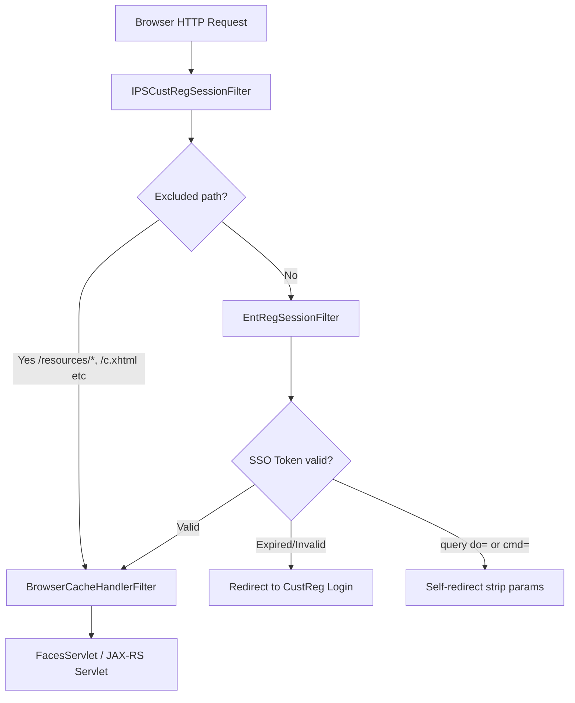
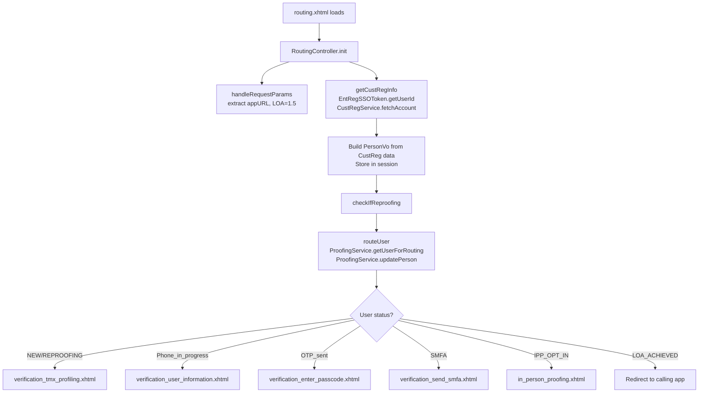
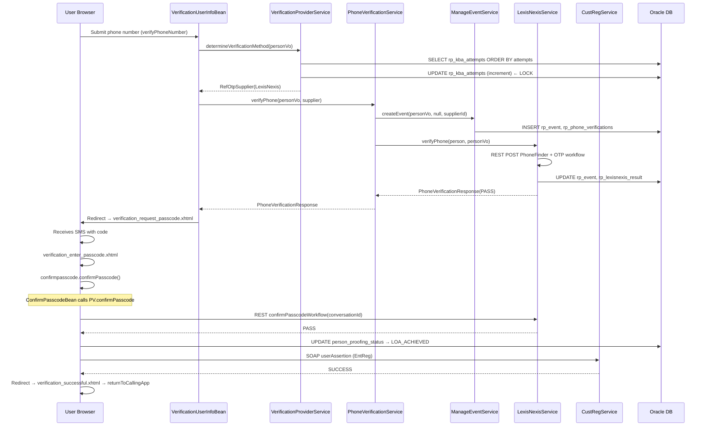
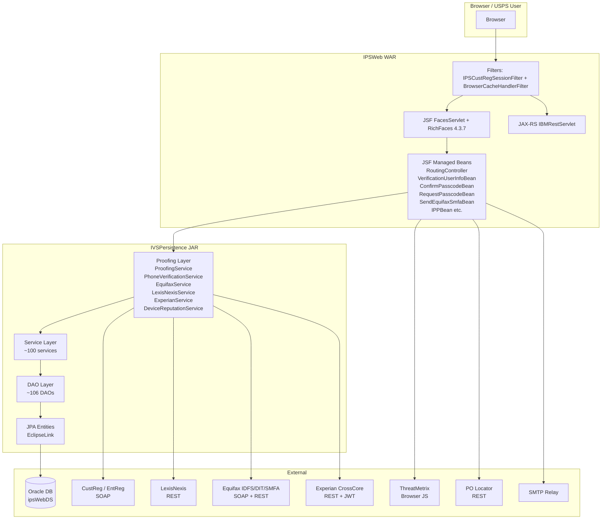

# IPSWeb — Complete Application Architecture Analysis
**Source:** IPSWeb.zip  
**Analysis date:** May 2026

---

## A. Executive Architecture Summary

IPSWeb is a **USPS-facing JSF web application** that serves as the citizen-facing frontend for the Identity Proofing System (IPS). It is the user-visible tier of a multi-module enterprise system whose business logic and persistence live in `IVSPersistence`.

**What it does in one sentence:** A USPS customer lands here after logging in through CustReg (Customer Registration), and IPSWeb guides them through remote identity verification (phone OTP, SMFA link, or device reputation) and/or in-person proofing at a Post Office, ultimately returning a proofing result back to CustReg.

**The system has two audiences:**
- **Citizens:** flowing through JSF pages (routing → TMX profiling → user info → phone verify → passcode → success/IPP)
- **Internal USPS systems:** REST resources (`/resources/rest`, `/resources/rss`, `/resources/analytics`) for IPP barcode scanning, reports, and Google Analytics data

**Critical architectural characteristic:** IPSWeb contains **almost no business logic itself**. It is a thin JSF presentation layer. All business logic is implemented in `IVSPersistence` services (`com.ips.proofing.*`, `com.ips.service.*`). IPSWeb beans are orchestrators that retrieve Spring beans at runtime and delegate to them.

---

## B. Technology Stack Inventory

| Category | Technology | Version / Notes |
|---|---|---|
| **Java** | Java 8+ (inferred from build) | Gradle 7.0.2 build |
| **Web Framework** | JSF 2.0 (MyFaces / IBM WAS JSF) | `javax.faces.DEFAULT_SUFFIX = .xhtml` |
| **UI Components** | RichFaces 4.3.7.Final | `a4j:`, `rich:` namespaces in XHTMLs |
| **App Server** | IBM WebSphere Application Server 9.x | `com.ibm.ws.jsf.*` params; `IBMRestServlet`; JAAS |
| **Spring** | Spring 5.3.33 | DI, `@Transactional`, `JtaTransactionManager` |
| **JPA / ORM** | EclipseLink (JPA 2.1) | Weaving=false; `IPSWebPUN` persistence unit |
| **Database** | Oracle (via JNDI `ipsWebDS`) | JTA-managed |
| **REST Framework** | JAX-RS 2.1 (IBM `IBMRestServlet`) | `@ApplicationPath("resources")` |
| **Build System** | Gradle 7.0.2 | `build.gradle`; WAR plugin |
| **Logging** | Log4j2 2.17.1 + SLF4J | `log4j2.xml`; custom `CustomLogger` wrapper |
| **JSON** | IBM JSON4J + Gson 2.8.5 + Jackson 2.13.1 | Mixed — varies by integration |
| **HTTP Client** | Apache Wink 1.4 + Apache HttpClient 4.5.13 | For vendor REST calls |
| **Security / SSO** | USPS `EntRegSessionFilter` (CustReg SSO) | `EntRegWebFilters-7.0.1.jar`; `StandAloneClient-7.0.1.jar` |
| **JWT** | JJWT 0.10.5 + BouncyCastle 1.64 | For Experian CrossCore |
| **Dependency Injection** | Spring `@Autowired` + JSF `@ManagedBean` | **Hybrid**: beans are JSF-managed, services are Spring-managed |
| **Transaction Management** | JTA via `JtaTransactionManager` + `@Transactional` | WebSphere-managed transactions |
| **External modules** | IVSPersistence (project dep), EquifaxIDFS, EquifaxRest, LexisNexisRDP, POLocator, IPPServices | Internal USPS Artifactory SNAPSHOTs |
| **State saving** | JSF server-side (`javax.faces.STATE_SAVING_METHOD = server`) | NOT serialized in session (MyFaces option) |

---

## C. Request Lifecycle Walkthrough

### Startup Sequence

1. WebSphere starts the application
2. Spring `ContextLoaderListener` fires → loads `/WEB-INF/application-context.xml`
   - Component scan: `com.ips` — picks up all `@Service`, `@Repository` beans from IVSPersistence
   - Wires `entityManagerFactory` → `LocalContainerEntityManagerFactoryBean` → `IPSWebPUN` persistence unit → Oracle via JNDI `ipsWebDS`
   - Wires `transactionManager` → `JtaTransactionManager`
   - Loads `ips.properties` via `PropertyPlaceholderConfigurer`
3. `IntrospectorCleanupListener` and `RequestContextListener` register
4. JSF `FacesServlet` lazy-loads on first request (`load-on-startup=-1`)
5. JAX-RS `IBMRestServlet` loads immediately (`load-on-startup=1`) → initializes `IPSWebApplication` → registers `GARestResource`, `IPSRestResource`, `ReportRestResource`, `RssRestResource`

### Per-Request Flow (JSF Pages)

```
Browser HTTP Request
    │
    ▼
WebSphere → Filter Chain
    │
    ├─[1] IPSCustRegSessionFilter (url-pattern: /*)
    │      Checks if path matches excludePatterns
    │      If NOT excluded: delegates to EntRegSessionFilter
    │        → validates CustReg SSO cookie/token
    │        → populates EntRegSSOToken on request attribute
    │        → if expired: redirects to CustReg login
    │        → if query string contains "do=" or "cmd=": self-redirect (CSRF guard)
    │
    ├─[2] BrowserCacheHandlerFilter (url-pattern: /*)
    │      Sets no-cache/no-store headers on all responses
    │
    ▼
FacesServlet (*.xhtml, *.faces)
    │
    ├─ JSF Restore View Phase
    ├─ Apply Request Values Phase
    ├─ Process Validations Phase
    ├─ Update Model Values Phase
    ├─ Invoke Application Phase → ManagedBean action methods called
    │
    └─ Render Response Phase
           CacheControlPhaseListener.beforePhase() fires
           → adds Cache-Control: no-cache, no-store headers
           → adds X-Content-Type-Options: nosniff
```

### Welcome File / Application Entry

The welcome file is `routing.xhtml`. Its only content in the JSF `<ui:define name="browser-title">` is:
```xhtml
#{routing.routeUser()}
```

This means **`routeUser()` on the `RoutingController` bean fires the moment the page renders title** — before any user interaction. This is the application's state machine entry point.

---

## D. Filter / Security / Session Architecture

### Filter 1: `IPSCustRegSessionFilter` — The Security Gatekeeper

**Position in chain:** First (order 1 in web.xml)  
**URL pattern:** `/*`  
**Class:** `com.ips.servlet.filter.IPSCustRegSessionFilter extends EntRegSessionFilter`

**Purpose:** Enforces CustReg SSO authentication for all JSF page requests.

**Logic (reconstructed):**

```
doFilter() called
  │
  ├─ Extract URL path after "/IPSWeb"
  ├─ Check if queryString contains "do=" or "cmd="
  │    → If YES: self-redirect to same URL (strips dangerous params) ← CSRF/injection guard
  │
  ├─ Check if path matches excludePatterns:
  │    /resources/rss, /resources/rest, /resources/remote, /resources/batch
  │    /css, /images, /js, /rfRes, /javax.faces.resource
  │    /c.xhtml, /c.faces (SMFA callback — must bypass auth)
  │    /verification_smfa_success.xhtml (SMFA success — must bypass auth)
  │    /systemError.xhtml (error page — must bypass auth)
  │
  │    → If EXCLUDED: chain.doFilter() directly (no auth)
  │    → If NOT EXCLUDED: super.doFilter() → EntRegSessionFilter
  │
  └─ EntRegSessionFilter (from EntRegWebFilters-7.0.1.jar — external jar):
       - Validates CustReg SSO token from request/session
       - Populates EntRegSSOToken on request attribute key EntRegSSOToken.REQUEST_KEY
       - If session expired: redirects to CustReg login URL
       - If new user logged in: flags as new login
```

**Key credential methods:**
- `getEntRegAPIClientEnv()` → calls `Utils.buildEntRegAPIClientEnv()` to build env-specific CustReg API config
- `getEntRegAppPasswordCredential()` → retrieves IPS app credentials from WebSphere J2C alias (`IPSConstants.ENT_REG_APP`)

**Exclude patterns risk:** `c.xhtml` and `verification_smfa_success.xhtml` are excluded because they are callback targets for the Equifax SMFA (Secure MFA) link flow — the user clicks the link on their phone and lands on these pages without being "in session" in the normal sense. This is a deliberate bypass, not a gap.

**CSRF guard behavior:** Any URL with `do=` or `cmd=` in the querystring triggers a self-redirect. This strips those parameters on the redirect. This is a lightweight defense against parameter injection.

---

### Filter 2: `BrowserCacheHandlerFilter`

**Position:** Second in chain  
**Purpose:** Sets HTTP no-cache headers on all responses. Implementation not in this ZIP (class referenced but file missing) — confirmed behavior via `CacheControlPhaseListener` which does the same thing at JSF render time as a belt-and-suspenders measure.

---

### Session Management Architecture

**Session objects stored in `HttpSession`:**

| Session Key (from `IPSConstants`) | Type | Set By | Purpose |
|---|---|---|---|
| `USER_KEY` | `UserVo` | `IPSController.setSessionUser()` | CustReg user identity, status, LOA |
| `PERSON_KEY` | `PersonVo` | `IPSController.setSessionPersonVo()` | Full PII + verification state; the primary session object |
| `APPOINTMENT_KEY` | `AppointmentVo` | `IPSController.setSessionAppointment()` | IPP appointment data |
| `CALLING_APP_URL_KEY` | `String` | `RoutingController.handleRequestParams()` | Return URL after proofing |
| `CALLING_APP_NAME_KEY` | `String` | `RoutingController` | e.g., "HoldMail", "InformedDelivery" |
| `LOA_LEVEL_KEY` | `String` | `RoutingController.handleRequestParams()` | Always set to "1.5" currently |
| `USER_ID_KEY` | `String` | `RoutingController.getCustRegInfo()` | CustReg userId from SSO token |
| `CLIENT_IP_ADDR` | `String` | `RoutingController.getCustRegInfo()` | User's IP (from CustReg headers) |
| `DEV_PROFILING_ENABLED_KEY` | `boolean` | `VerificationUserInfoHmBean` | Whether TMX device profiling is active |
| `DEV_PROFILING_SESSIONID_KEY` | `String` | `VerificationUserInfoHmBean` | ThreatMetrix session ID |
| `OTP_SMFA_ATTEMPTS_KEY` | `int` | `IPSController` | Tracks SMFA send attempts |
| `FILTERED_PO_LIST_KEY` | `List` | `IPSController` | Cached PO Locator results |
| `REDIRECT_PAGE_URL_KEY` | `String` | `IPSController.redirectToPage()` | Next page URL for redirect bean |
| `DEVICE_ASSESSMT_PARAM_VO` | `DeviceAssessmentParamVo` | Various beans | Device reputation params |

**Session timeout handling:**
- `ViewExpiredException` → mapped to `/sessionTimeout.xhtml` in web.xml error-page
- `SessionTimeoutBean.create()` removes `SESSION_TIMEOUT_KEY` from session
- `SessionTimeoutBean.logIn()` redirects to CustReg login URL

**User session mismatch detection:** `IPSController.verifyUserSessionData()` — compares `EntRegSSOToken.getUserId()` against `UserVo.getSponsorUserId()` in session. If different (user logged out and logged in as someone else in another tab), redirects to login.

---

## E. Service Layer Responsibilities

The service layer is almost entirely defined in `IVSPersistence`. IPSWeb beans resolve Spring beans at runtime via:
- `SpringUtil.getInstance(ctx).getBean(SERVICE_NAME)` — static Spring context lookup
- `WebApplicationContextUtils.getWebApplicationContext(ctx).getBean(...)` — for typed lookups
- `JSFUtils.getManagedBean("beanname")` — for JSF-managed bean lookups between beans

**Service name constants are all defined in `IPSController`** — 30+ static final strings.

### Key Bean → Service relationships

| Managed Bean | Spring Services Used |
|---|---|
| `RoutingController` | `ProofingService`, `CustRegService`, `PersonDataService`, `RefLoaLevelService`, `PersonProofingStatusService`, `RefRpStatusDataService` |
| `VerificationUserInfoBean` | `PhoneVerificationService`, `ProofingService`, `PersonDataService`, `RpEventDataService`, `RefOtpSupplierDataService`, `RpDeviceReputationService` |
| `VerificationUserInfoHmBean` | Same as above + `DeviceReputationService`, `VerificationProviderService`, `HighRiskAddressService` |
| `ConfirmPasscodeBean` | `PhoneVerificationService`, `PersonDataService`, `OtpVelocityCheckService`, `RpEventDataService`, `RpOtpAttemptDataService` |
| `RequestPasscodeBean` | `PhoneVerificationService`, `RpEventDataService`, `PersonDataService`, `OtpVelocityCheckService` |
| `SendEquifaxSmfaBean` | `PhoneVerificationService`, `SmfaVelocityCheckService`, `RpEventDataService`, `RefOtpSupplierDataService` |
| `ValidateEquifaxSmfaBean` | `EquifaxService`, `ProofingService`, `RefSponsorDataService`, `RefSponsorConfigurationService` |
| `IPPBean` | `ProofingService`, `IppEventService`, `PersonDataService`, `VerifyAddressService` |
| `VerificationTmxProfilingBean` | `ProofingService`, `DeviceReputationService`, `HighRiskAddressService`, `PersonDataService` |
| `GARestResource` | `CustRegService` |

---

## F. Major Business Workflows

### Workflow 1 — Application Entry / User Routing

**Entry point:** Browser GET to `routing.xhtml` (welcome file)

```
Browser → EntRegSessionFilter validates SSO cookie
    ↓
routing.xhtml renders → #{routing.routeUser()} fires
    ↓
RoutingController.init() [@PostConstruct]
  ├─ handleRequestParams(): extract appURL (return URL), LOA param from query string
  │   Note: LOA is hardcoded to "1.5" regardless of request param
  ├─ getCustRegInfo(): extract EntRegSSOToken from request attribute
  │   ├─ Store userId in session
  │   ├─ Store client IP in session
  │   ├─ Call CustRegService.fetchAccount(userId) → SOAP to CustReg EntRegProxy
  │   ├─ Build PersonVo from CustReg account (name, address, phone, email)
  │   ├─ Store PersonVo in session
  │   └─ checkIfReproofing() → ProofingService.checkIfReproofing()
    ↓
RoutingController.routeUser()
  ├─ Get PersonVo from session
  ├─ Check PersonProofingStatus (DB lookup by personId)
  ├─ Set LOA = "1.5" on UserVo
  ├─ ProofingService.getUserForRouting(user) → determines user's current status
  ├─ ProofingService.updatePerson(personVo) → upsert Person + PersonData + lockout record
  ├─ If user already has LOA: → verification_status.xhtml
  └─ IPSController.routeUser(user) → getNextPage(user)
```

**`getNextPage()` status machine** (routes based on `user.getStatusCode()`):

| Status | Destination |
|---|---|
| NEW_TO_IPS, REPROOFING | `verification_tmx_profiling.xhtml` |
| RP_FAILED, RP_CANCELLED | `verification_tmx_profiling.xhtml` |
| Phone_verification_initiated, Phone_verification_failed | Velocity check → `verification_user_information.xhtml` or `verification_lockout.xhtml` |
| Phone_verified, OTP_initiated | High-risk/device check → `verification_request_passcode.xhtml` or `unable_to_verify.xhtml` |
| OTP_sent, OTP_confirmation_initiated/failed | High-risk/device check → `verification_enter_passcode.xhtml` |
| SMFA_initiated/sent/validation_* | `verification_send_smfa.xhtml` |
| IPP_OPT_IN, IPP_EMAIL_SENT | `in_person_proofing.xhtml` |
| IPP_FAILED | `verification_failure.xhtml` |
| IPP_RESIDENCE_SCHEDULED | If future date: `appointment_confirmation.xhtml`; past date: `verification_error.xhtml` |
| IPP_RESIDENCE_OPT_IN | `address_confirmation.xhtml` |
| LOA_level_achieved | Redirect to Informed Delivery success URL |
| ERROR | `systemError.xhtml` |

---

### Workflow 2 — TMX Device Profiling (ThreatMetrix)

**Entry point:** `verification_tmx_profiling.xhtml` → `VerificationTmxProfilingBean`

```
Page loads → tmxProfiling.initDeviceReputationProfiler()
  ├─ Check if device profiling is enabled for this sponsor
  ├─ Generate ThreatMetrix session ID (stored in session)
  ├─ Store client IP in session
  └─ XHTML renders TMX profiling JavaScript tag with sessionId
      (JavaScript fires background call to ThreatMetrix servers)

User clicks "Continue" → tmxProfiling.updateUserInfo()
  ├─ Validates session data
  ├─ Update proofing status to STARTED_REMOTE_PROOFING
  └─ Redirect to verification_user_information.xhtml

OR → tmxProfiling.assessDeviceReputation()
  ├─ DeviceReputationService.createDeviceReputationResult()
  │   → Calls LexisNexis RDP Device Assessment API
  │   → Stores result in rp_device_reputation
  ├─ If device REJECT: route to unable_to_verify
  └─ If device PASS/REVIEW: route to verification_user_information
```

---

### Workflow 3 — Phone Verification (OTP Path)

**Entry point:** `verification_user_information.xhtml` → `VerificationUserInfoBean` (`@SessionScoped`)

```
Page loads → userInfo.updateUserInfo()
  ├─ Load PersonVo from session
  ├─ Pull existing phone/address from PersonData
  └─ Render form with phone number (masked)

User submits → userInfo.verifyPhoneNumber()
  ├─ Validate phone number format
  ├─ VerificationProviderService.determineVerificationMethod(personVo)
  │    → Queries rp_kba_attempts → selects supplier (LexisNexis/Equifax/Experian)
  │    → Increments attempt counter in DB (the lock hotspot)
  ├─ ProofingService.phoneVelocityCheck(person, personVo, supplier)
  │    → Checks kba_lockout_info + rp_event count in window
  │    → If locked: goToPage(VERIFICATION_LOCKOUT)
  ├─ PhoneVerificationService.verifyPhone(personVo, supplier)
  │    → ManageEventService.createEvent() → INSERT rp_event + rp_phone_verifications
  │    → [LexisNexis] → requestPhoneFinder() + callOtpWorkflow() → REST to LexisNexis
  │    → [Equifax IDFS] → SOAP to Equifax IDFS endpoint
  │    → [Equifax DIT] → OAuth2 + REST to Equifax DIT endpoint
  │    → [Experian] → JWT + REST to CrossCore endpoint
  │
  └─ Route based on pvResponse.decision:
       PASS/REVIEW → goToPage(VERIFICATION_REQUEST_PASSCODE_PAGE)
       SMFA path   → goToPage(VERIFICATION_SEND_SMFA_PAGE)
       URL invoke  → goToPage(VERIFICATION_URL_INVOCATION_PAGE?resultid=X)
       FAIL        → goToPage(UNABLE_TO_VERIFY_PAGE)
       All failed  → goToPage(UNABLE_TO_VERIFY_PAGE)
```

---

### Workflow 4 — OTP Passcode Send & Confirm

**Send Passcode — `verification_request_passcode.xhtml` → `RequestPasscodeBean`**

```
User clicks "Send Code" → requestpasscode.sendPasscodeToPhone()
  ├─ Fetch latest RpEvent from session/DB
  ├─ Determine supplier from event
  ├─ PhoneVerificationService.sendPasscodeSuccessful(personVo, supplier)
  │    → [Equifax IDFS] SOAP InitialIDFSRequest/SendPasscodeIDFSRequest
  │    → [LexisNexis] REST callOtpWorkflow
  │    → [Experian] CrossCore resend flow
  ├─ Update proofing status → OTP_SENT
  └─ If success: goToPage(VERIFICATION_ENTER_PASSCODE_PAGE)
     If fail: goToPage(VERIFICATION_REQUEST_PASSCODE_PAGE) with error
```

**Confirm Passcode — `verification_enter_passcode.xhtml` → `ConfirmPasscodeBean`**

```
User enters passcode → confirmpasscode.confirmPasscode()
  ├─ OtpVelocityCheckService — check attempt limits
  ├─ PhoneVerificationService.confirmPasscode(personVo, supplier, event)
  │    → [Equifax IDFS] SOAP ConfirmPasscodeIDFSRequest
  │    → [LexisNexis] REST callConfirmPasscodeWorkflow(conversationId)
  │    → [Experian] CrossCore confirm
  ├─ If confirmed:
  │    → ProofingService.updateProofingStatus(LOA_ACHIEVED)
  │    → TruthDataReturnService.returnRemoteProofingTruthData()
  │       → CustRegService.userAssertion() → SOAP to CustReg
  │    → goToPage(VERIFICATION_SUCCESSFUL_PAGE)
  ├─ If wrong passcode:
  │    → Increment attempt counter
  │    → If exceeded: goToPage(VERIFICATION_LOCKOUT)
  └─ If expired: set passcodeExpired=true, show error on page
```

---

### Workflow 5 — SMFA Link Flow (Equifax SMFA)

**Entry point:** `verification_send_smfa.xhtml` → `SendEquifaxSmfaBean`

```
Page loads — user sees "Send secure link to phone"

User clicks "Send Link" → sendEquifaxSmfa.sendLinkToPhone()
  ├─ SmfaVelocityCheckService — check SMFA attempt limits
  ├─ PhoneVerificationService.sendSmfaLink(personVo, supplier, isDesktop)
  │    → EquifaxService.sendSmfaLink()
  │       → OAuth2 token → POST to Equifax SMFA initiate endpoint
  │       → Returns SMFA link URL
  │       → SMS message sent to user phone: "USPS: Tap this secure link..."
  ├─ Store SMFA transaction ID in session
  └─ goToPage(VERIFICATION_VALIDATE_SMFA_PAGE)

User taps link on mobile → lands on c.xhtml (auth BYPASSED by filter)
  → c.xhtml redirects to verification_smfa_success.xhtml

SmfaSuccessBean — validates SMFA result server-side
  → EquifaxService calls SMFA status endpoint
  → If APPROVED: update status, return to calling app

ValidateEquifaxSmfaBean.getColor() — polls for decision
  → If pending: stay on page (JavaScript polling)
  → If GREEN: goToPage(VERIFICATION_VALIDATE_SMFA_GREEN_PAGE)
  → If RED: goToPage(VERIFICATION_VALIDATE_SMFA_RED_PAGE)
  → If error: goToPage(VERIFICATION_SEND_SMFA_PAGE) (retry)
```

---

### Workflow 6 — In-Person Proofing (IPP) Opt-In

**Entry point:** `in_person_proofing.xhtml` → `IPPBean`

```
Page loads → ippBean.init()
  ├─ ProofingService.getIppPageUserInfo(user) — load IPP context
  ├─ Store recordLocator in session
  └─ Render PO search form

User searches for Post Office → ippBean.searchByZipCode()
  ├─ POLocator REST call (USPS Shipping API)
  ├─ Filter results for facilities offering IPP
  └─ Display list

User selects facility → ippBean.checkForObjects()
  ├─ VerifyAddressService — check address geocoordinates
  ├─ HighRiskAddressService — high-risk address check
  ├─ IppEventService.optIn() — creates IppEvent (DB INSERT)
  │    @Transactional: creates event + updates person + links device reputation
  ├─ ProofingService.updateProofingStatus(IPP_OPT_IN)
  ├─ CustRegService.assertOptInIpp() → SOAP to CustReg
  └─ Send confirmation email → goToPage(APPOINTMENT_CONFIRMATION)
```

---

### Workflow 7 — Return to Calling App

**Entry point:** Called from `IPSController.returnToCallingApp(proofingStatus)` throughout the flow

```
returnToCallingApp(PASSED or FAILED)
  │
  ├─ Retrieve callingAppURL from session
  │
  ├─ If callingAppURL == null → goToLogin()
  │
  ├─ If HoldMail sponsor:
  │    PASSED → redirect to callingAppURL
  │    FAILED → check HoldMail flow flag from RefSponsorConfiguration
  │              "True" → redirect to failure redirect page (cvmverify)
  │              "False" → redirect to callingAppURL?ivsRedirect=false
  │
  ├─ If Informed Delivery (callingApp starts with allowedDomain):
  │    → redirect to callingAppURL (or local success page for dev)
  │
  └─ Else: illegal appURL → redirect to allowedDomain (CUSTREG)
```

**Open redirect protection:** `isCallingAppAllowed()` checks `callingAppURL.startsWith(allowedDomain)` — the allowed domain is loaded from `ips.properties` at startup. Only CUSTREG domains are allowed.

---

## G. Database Interaction Analysis

IPSWeb contains **no DAOs and no direct JPA calls**. All persistence goes through `IVSPersistence` Spring services. The key patterns and risks are in `IVSPersistence`, but two patterns are observable from the bean layer:

**Frequently accessed in every page load (read path):**
- `PersonDataService.findByPK(personVo.getId())` — loads full Person graph (EAGER — 6 collections)
- `PersonProofingStatusService.getByPersonId()` — status check on routing
- `RpEventDataService.findEventByPersonId()` / `findEventBySponsorUserId()` — supplier and event lookup

**Written on every verification attempt:**
- `rp_kba_attempts` UPDATE (via `OtpAttemptConfigService.callingOTP()`) — the row lock hotspot
- `rp_event` INSERT (via `ManageEventService.createEvent()`)
- `person_proofing_status` UPDATE (via `ProofingService.updateProofingStatus()`)

**Transaction boundary risk:** The `ConfirmPasscodeBean.confirmPasscode()` method calls `PhoneVerificationService.confirmPasscode()` (which calls a vendor SOAP/REST endpoint) and `ProofingService.updateProofingStatus()` in sequence with **no wrapping transaction**. If the vendor call succeeds but the DB write fails, the system is in an inconsistent state.

**N+1 risk:** `IPSController.getNextPage()` calls `PersonProofingStatusService.getByPersonId()` separately from `PersonDataService.findByPK()`. The `findByPK` already EAGER-loads proofing statuses, meaning the second call is redundant and generates an additional query on every page load.

---

## H. External Integrations

### Integrations called from IPSWeb beans

| System | Bean(s) | Service | Protocol | What |
|---|---|---|---|---|
| **CustReg / EntReg** | `RoutingController` | `CustRegService.fetchAccount()` | SOAP via `EntRegProxy` | Fetch full user account on entry |
| **CustReg / EntReg** | `RoutingController` | `CustRegService.userAssertion()` | SOAP | Assert proofing result back |
| **CustReg SSO** | All pages | `EntRegSessionFilter` (external jar) | HTTP header/cookie | Session validation every request |
| **LexisNexis** | `VerificationUserInfoBean` | `PhoneVerificationService` → `LexisNexisService` | HTTPS REST | Phone verification + OTP workflows |
| **Equifax IDFS** | `VerificationUserInfoBean`, `ConfirmPasscodeBean` | `EquifaxService` | HTTPS SOAP | Phone verify + passcode confirm |
| **Equifax DIT** | `VerificationUserInfoBean` | `EquifaxService` | HTTPS REST (OAuth2) | Phone verify via DIT |
| **Equifax SMFA** | `SendEquifaxSmfaBean`, `ValidateEquifaxSmfaBean` | `EquifaxService` | HTTPS REST (OAuth2) | SMFA link send + status poll |
| **Experian CrossCore** | `VerificationUserInfoBean` | `ExperianService` | HTTPS REST (JWT) | Identity verification + Boku OTP |
| **ThreatMetrix (TMX)** | `VerificationTmxProfilingBean`, `VerificationUserInfoHmBean` | `DeviceReputationService` | Browser JS → LexisNexis RDP | Device fingerprinting |
| **USPS PO Locator** | `IPPBean` | `ProofingService` via `POLocator` module | HTTP REST | Find Post Offices for IPP |
| **USPS GIS Geocoder** | `IPPBean` | `VerifyAddressService` | HTTP REST | Address geocoding for facilities |
| **USPS Shipping API** | `IPPBean` | `VerifyAddressService` | HTTP REST | Address standardization/verification |
| **SMTP** | `IPPBean` | `Emailer` | SMTP TLS (auth-mailrelay.usps.gov:587) | IPP confirmation emails |
| **IDM / PubTasks** | `IPPBean` | `ProofingService.createIPPUser()` | SOAP | Create IPP user in identity management |
| **Google Analytics** | `GARestResource` | `CustRegService` | JAX-RS GET → JSON | Return account type + zip for GA |

### Integration Timeout/Retry (from bean behavior)

- **CustReg fetchAccount:** If returns null → `goToPage(SYSTEM_ERROR_PAGE)` immediately. No retry.
- **Vendor phone verify failures:** `PhoneVerificationService` implements failover to next supplier on `PhoneVerificationException`. Up to all available suppliers tried before returning FAIL.
- **SMFA validation:** JavaScript polling on `verification_validate_smfa.xhtml` — timeout not clear from available code.
- **PO Locator:** Not clear from code whether timeout is configured.

---

## I. Dependency / Call Flow Diagrams

### Filter Chain



### Request Routing Flow



### Remote Proofing Sequence



### Layered Architecture



---

## J. Production Risk Areas / Technical Debt

### 🔴 Critical Risks

**1. `#{routing.routeUser()}` fires in `<ui:define name="browser-title">` on routing.xhtml**
This means `routeUser()` executes during JSF's Render Response phase — not during Invoke Application as would be conventional. This is a side-effectful action (DB writes, external CustReg SOAP call) embedded in what appears to be a UI property binding. If JSF evaluates the EL expression more than once (which can happen in partial renders, AJAX requests, or view restoration), it fires multiple times. This is the #1 architectural risk.

**2. `VerificationUserInfoBean` and `ConfirmPasscodeBean` are `@SessionScoped`**
These beans hold verification state across requests. Because JSF's `@SessionScoped` is the same as HTTP session scope, these beans persist across browser tab reuse and back-button navigation. If a user opens a second tab or uses the back button, the `confirmPasscodeInvoked` flag, `passcodeExpired`, and `phoneVerificationAttemptCount` may be in an inconsistent state. This is the root cause of the "back button causes NPE" defect class mentioned in your transcript analysis.

**3. Spring beans resolved at runtime via `SpringUtil.getInstance(ctx).getBean()`**
Every page action method in every bean fetches Spring beans from the ApplicationContext by name string at runtime. There is no compile-time type checking — a typo in a bean name (`"personDataService"` vs `"PersonDataService"`) causes a `NoSuchBeanDefinitionException` at runtime. This also means IDE refactoring doesn't catch mismatches.

**4. `ConfirmPasscodeBean.confirmPasscode()` — no wrapping transaction across vendor + DB**
The bean calls the SOAP/REST vendor confirm, then the DB update as two separate operations without a wrapping transaction. If the DB write fails after a vendor SUCCESS, the user is verified at the vendor but not in IPS. The system will be stuck unless manually corrected.

**5. `UserVo.statusCode == 8L` hardcoded**
In `RoutingController.getCustRegInfo()`, the check `if (user.getStatusCode() != 8L)` and `if (refRpStatus.getStatusCode() == 8L)` use a magic number. Status code 8 appears to be "Phone_verification_initiated" based on context. This is fragile — if the status code changes in `RefRpStatus`, this silently breaks routing.

### 🟡 High Risk

**6. `IPSController` is a God class with 600+ lines**
It contains: all page constant strings, all service bean name constants, all session attribute getters/setters, redirect logic, calling-app validation, lockout display logic, IP extraction, admin routing, all navigation utilities. Every managed bean extends it. This creates a massive coupling surface — changes to `IPSController` affect every bean.

**7. `NoopFilter` does a forward instead of allowing request to proceed**
`NoopFilter.doFilter()` calls `request.getRequestDispatcher(...).forward(request, response)` rather than `chain.doFilter()`. This means if `NoopFilter` is active in the chain, it terminates the filter chain and bypasses all subsequent filters including security filters. Not clear from this ZIP where `NoopFilter` is mapped — not in this web.xml — but its existence is a risk.

**8. `c.xhtml` is excluded from authentication**
The SMFA callback page `c.xhtml` bypasses `EntRegSessionFilter` entirely. The application must rely on Equifax's SMFA token being opaque enough to be unguessable. Any exposure of SMFA callback URLs could theoretically allow unauthenticated access to `c.xhtml`. This is a known design tradeoff but should be documented.

**9. `LOA` parameter hardcoded to "1.5" in `handleRequestParams()`**
```java
loaSought = IPSConstants.LOA_15;  // ← hardcoded, ignoring request param
```
The code reads the LOA query parameter but then immediately overwrites it. LOA 2.0 support appears to be vestigial — routing always sends users down the 1.5 path.

**10. `restResource classes` (IPSRestResource, ReportRestResource, RssRestResource) not in this ZIP**
These are registered in `IPSWebApplication.getClasses()` but their source is not present. Their behavior cannot be analyzed. They handle `/resources/rest/*`, `/resources/batch/*`, and `/resources/rss/*` — which are all excluded from authentication by the filter. If any of these expose sensitive data without their own auth, it is a vulnerability.

**11. `allowedDomain` loaded once at class-load time (static initializer)**
```java
static { allowedDomain = Utils.getProperty(ALLOWED_DOMAIN); }
```
If `Utils.getProperty()` fails at class load (e.g., properties not loaded yet), `allowedDomain` is null, and `isCallingAppAllowed()` will NPE or incorrectly allow all apps.

### 🟢 Informational

**12. RichFaces JMS push disabled**
`org.richfaces.push.jms.disable = true` — the push/WebSocket feature is explicitly disabled. No real-time server push is used.

**13. `reload-interval=3` in `ibm-web-ext.xml`**
WebSphere is configured to check for application changes every 3 seconds. This is a development-mode setting and should not be in production configuration.

**14. JSF state saving = server, not serialized**
`org.apache.myfaces.SERIALIZE_STATE_IN_SESSION = false` means view state is stored in memory only. Under WebSphere cluster without sticky sessions, users switching nodes will get `ViewExpiredException`. The `ViewExpiredException` is mapped to `/sessionTimeout.xhtml`, which is the correct failsafe.

---

## K. Recommended Onboarding Order

Study in this order for fastest practical understanding:

| Order | Class / File | Why |
|---|---|---|
| 1 | `ips.properties` | All URLs, credentials aliases, and environment configs in one file |
| 2 | `web.xml` | Complete picture of filters, servlets, error pages, welcome file |
| 3 | `IPSConstants.java` (in IVSPersistence) | All status codes, session keys, business constants |
| 4 | `IPSController.java` | Base class for all beans; all page names, service names, session accessors |
| 5 | `RoutingController.java` | Application entry point; understand status machine in `getNextPage()` |
| 6 | `IPSCustRegSessionFilter.java` | Security boundary; understand what is and isn't protected |
| 7 | `VerificationUserInfoBean.java` | The main phone verification flow entry point |
| 8 | `ConfirmPasscodeBean.java` | The passcode confirmation — most production incidents happen here |
| 9 | `PersonVo.java` (in IVSPersistence) | The session DTO — every flag on it controls behavior |
| 10 | `PhoneVerificationServiceImpl.java` (IVSPersistence) | Supplier routing + failover logic |
| 11 | `VerificationProviderServiceImpl.java` (IVSPersistence) | The split-percentage supplier selection (the DB lock source) |
| 12 | `SendEquifaxSmfaBean.java` + `ValidateEquifaxSmfaBean.java` | SMFA flow — hardest to trace |
| 13 | `IPPBean.java` | In-person proofing opt-in |
| 14 | `GARestResource.java` + `IPSWebApplication.java` | REST layer + understand what other REST resources exist |
| 15 | `VerificationTmxProfilingBean.java` | Device reputation / ThreatMetrix flow |
