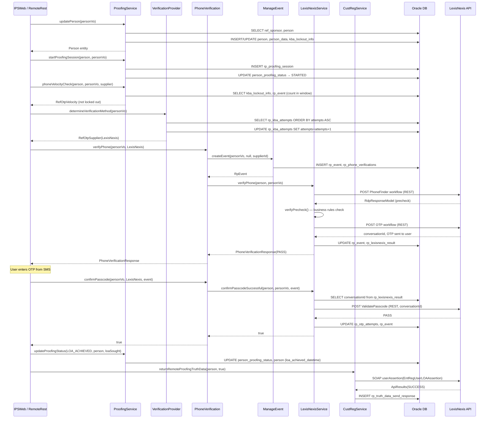
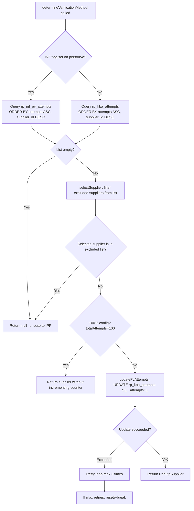

# IVSPersistence — Service Layer & Business Architecture Analysis
**Source:** IVSPersistence.zip · Full service, DAO, proofing, and config layers  
**Analysis date:** May 2026

---

## A. High-Level Architecture Summary

IVS (Identity Verification System) is a **USPS identity proofing platform** that verifies the identity of USPS digital customers before granting elevated levels of assurance (LOA 1.5 / LOA 2.0). It does this through two channels:

**Remote Proofing (RP):** The user stays online. The system verifies their phone number (via SMS OTP or SMFA link) and/or identity attributes (name, DOB, address) by calling one of three external identity vendors — LexisNexis, Equifax, or Experian. If remote proofing fails, the user is offered In-Person Proofing.

**In-Person Proofing (IPP):** The user visits a USPS Post Office. A clerk scans a barcode, checks government ID, and manually completes the proofing event. The result is recorded as an IPP event.

Both channels report their outcome back to the USPS Customer Registration system (CustReg / EntReg) via a SOAP assertion API, which updates the user's LOA level in the central identity store.

**The application is not a standalone web app.** IVSPersistence is a **shared persistence module** — a JAR/library consumed by at minimum four deployed applications:
- `IPSWeb` — JSF-based UI for the citizen proofing workflow
- `IPPRest` — REST API for clerk-facing IPP barcode scanning
- `RemoteRest` — REST API for the remote proofing workflow (phone verification, passcode)
- `IVSAdmin` — Admin UI for internal USPS operations staff

All four share the same Oracle datasource (`ipsWebDS`), the same JPA persistence units, and the same Spring service beans in this module.

---

## B. Layered Architecture Overview

```
┌──────────────────────────────────────────────────────────────────────┐
│  CONSUMERS (separate WAR/EAR deployments, not in this ZIP)           │
│  IPSWeb (JSF)  │  IPPRest (JAX-RS)  │  RemoteRest  │  IVSAdmin      │
└────────────────────────────┬─────────────────────────────────────────┘
                             │ Spring DI / @Autowired
┌────────────────────────────▼─────────────────────────────────────────┐
│  PROOFING LAYER  com.ips.proofing  (Business Orchestration)           │
│  ProofingServiceImpl          ManageEventServiceImpl                  │
│  PhoneVerificationServiceImpl VerificationProviderServiceImpl         │
│  EquifaxServiceImpl           LexisNexisServiceImpl                   │
│  ExperianServiceImpl          CheckDeviceServiceImpl                  │
│  DeviceReputationServiceImpl  ManageDeviceReputationServiceImpl       │
│  CommonRestServiceImpl        TruthDataReturnServiceImpl (in service) │
└────────────────────────────┬─────────────────────────────────────────┘
                             │
┌────────────────────────────▼─────────────────────────────────────────┐
│  SERVICE LAYER  com.ips.service  (~100 service interfaces + impls)    │
│  PersonDataServiceImpl        OtpAttemptConfigServiceImpl             │
│  IppEventServiceImpl          RpEventDataServiceImpl                  │
│  PhoneVelocityCheckServiceImpl OtpVelocityCheckServiceImpl            │
│  CustRegServiceImpl           ReportServiceImpl                       │
│  All Ref* data services       All Rp* data services                   │
└────────────────────────────┬─────────────────────────────────────────┘
                             │
┌────────────────────────────▼─────────────────────────────────────────┐
│  DAO LAYER  com.ips.dao / com.ips.dao.impl  (106 DAOs)                │
│  All extend GenericJPADAO<Entity, PK>                                 │
│  JPA/EclipseLink + @NamedQuery + native queries                       │
└────────────────────────────┬─────────────────────────────────────────┘
                             │
┌────────────────────────────▼─────────────────────────────────────────┐
│  PERSISTENCE  JPA 2.1 / EclipseLink / JTA / Oracle                   │
│  4 persistence-units: IVSAdminPUN, IPPRestPUN, RemoteRestPUN,         │
│  IPSWebPUN — all share datasource ipsWebDS                            │
└──────────────────────────────────────────────────────────────────────┘

EXTERNAL INTEGRATIONS:
  Equifax IDFS SOAP     — usidentityfraudservicev2 (WSDL)
  Equifax DIT REST      — OAuth2 + REST (id-risk-assessment/v2)
  Equifax SMFA REST     — OAuth2 + REST (secure-mfa)
  LexisNexis RDP REST   — REST conversations API (workflows)
  Experian CrossCore    — JWT + REST (CrossCore API)
  CustReg / EntReg      — SOAP (EntRegProxy, userAssertion API)
  USPS GIS Geocoder     — REST (arcgis findAddressCandidates)
  USPS Shipping API     — REST (POLocatorV2, GetAddress, Verify)
  LDAP (WebSphere JAAS) — ldaps://eagandcs-*.usps.gov:636
  SMTP                  — auth-mailrelay.usps.gov:587
  IDM (PubTasks)        — SOAP/REST (TEWS6/PubTasks)
```

**Frameworks in use:**
- **Spring Framework** (not Spring Boot) — DI, `@Service`, `@Transactional`, `@Autowired`
- **JSF (JavaServer Faces)** — UI framework for IPSWeb; `FacesContext` referenced in service layer
- **EclipseLink** — JPA provider (Weaving=false, JTA transactions)
- **WebSphere Application Server** — runtime; J2C alias credential store; JAAS for LDAP auth
- **Quartz Scheduler** — 5 scheduled jobs via cron triggers in `ips.properties`
- **Apache Wink** — REST client used for LexisNexis and Equifax REST calls
- **Apache HttpClient** — used for Equifax OAuth and Experian CrossCore HTTP calls
- **JAXB / SOAP** — for Equifax IDFS (SOAP) and CustReg (EntRegProxy) integration
- **Gson** — JSON serialization for Equifax DIT/SMFA request/response models
- **Log4j2** — logging

---

## C. Service Class Inventory and Responsibilities

### Proofing Layer — Core Orchestration

| Service | Responsibility | Key Methods | Tables Touched | Downstream Calls |
|---|---|---|---|---|
| `ProofingServiceImpl` | Central orchestrator for Remote Proofing session lifecycle | `updatePerson()`, `updateProofingStatus()`, `startProofingSession()`, `phoneVelocityCheck()`, `lockoutStillInEffect()`, `getUniqueUID()` | `person`, `person_data`, `person_proofing_status`, `rp_proofing_session`, `kba_lockout_info`, `ref_rp_status`, `ref_loa_level` | `PersonDataService`, `PhoneVelocityCheckService`, `RefRpStatusService`, `IppEventService`, `RpProofingSessionService`, `Emailer` |
| `PhoneVerificationServiceImpl` | Routes phone verification to the correct supplier; handles supplier failover logic | `verifyPhone()`, `confirmPasscode()`, `sendPasscodeSuccessful()` | Reads `ref_kba_attempts`; delegates DB writes to vendor services | `EquifaxService`, `LexisNexisService`, `ExperianService`, `VerificationProviderService`, `OtpAttemptConfigService` |
| `VerificationProviderServiceImpl` | Determines which OTP supplier to use based on split-percentage config; increments attempt counter | `determineVerificationMethod()` (4 overloads), `selectSupplier()`, `selectSupplierForInf()`, `updatePvAttempts()` | `rp_kba_attempts`, `rp_inf_pv_attempts` | `OtpAttemptConfigService`, `RpInfPvAttemptConfigService`, `RefLoaLevelService`, `RefSponsorDataService` |
| `ManageEventServiceImpl` | Creates `RpEvent` + associated child records; saves cross-supplier phone verification results | `createEvent()` @Transactional, `savePreviousPhoneVerificationResults()` @Transactional | `rp_event`, `rp_phone_verifications`, `rp_phone_verification_results`, `rp_equifax_result`, `rp_lexisnexis_result`, `rp_experian_decision_result`, `rp_proofing_session` | `RpEventDataService`, `PersonDataService`, `RefLoaLevelService`, `RpProofingSessionService` |
| `EquifaxServiceImpl` | All Equifax interactions: IDFS SOAP phone verify, DIT REST initiate, SMFA REST | `verifyPhone()`, `verifyPhoneWithEquifaxIDFS()`, `verifyPhoneWithEquifaxDIT()`, `sendPasscodeSuccessful()`, `confirmPasscodeSuccessful()`, `generateEquifaxBearerToken()` | `rp_event`, `rp_phone_verifications`, `rp_otp_attempts`, `rp_smfa_attempts`, `rp_equifax_result` | Equifax IDFS SOAP endpoint, Equifax DIT REST, Equifax SMFA REST, `CommonRestService`, `ManageEventService`, `RpEventDataService` |
| `LexisNexisServiceImpl` | All LexisNexis interactions: PhoneFinder, OTP workflow, Passcode confirm | `verifyPhone()`, `requestPhoneFinder()`, `callOtpWorkflow()`, `sendPasscodeSuccessful()`, `confirmPasscodeSuccessful()`, `verifyPrecheck()` | `rp_event`, `rp_phone_verifications`, `rp_lexisnexis_result`, `rp_otp_attempts` | LexisNexis REST conversations API, `CommonRestService`, `ProofingService`, `LexisNexisDataService` |
| `ExperianServiceImpl` | Experian CrossCore JWT auth + identity workflow; Boku silent auth / OTP flow | `verifyPhone()`, `verifyPhoneWithExperianCrossCore()`, `callCrossCoreWorkflow()`, `callBokuSendOtpWorkflow()`, `resendPasscodeSuccessful()` | `rp_event`, `rp_experian_decision_result`, `rp_experian_header_data`, `rp_experian_response_payload` | Experian CrossCore REST, Boku auth, `CommonRestService`, `ExperianDataService` |
| `CheckDeviceServiceImpl` | Entry point for device reputation check (CheckDevice API call); returns JSON response | `getDeviceReputationStatus()`, `isHighRiskAddress()` | `rp_device_reputation`, `high_risk_address_attempts` | `DeviceReputationService`, `HighRiskAddressService` |
| `DeviceReputationServiceImpl` | Full device profiling with LexisNexis RDP; manages sessions, asserts to CustReg | `createDeviceReputationResult()`, `isDeviceProfilingEnabled()`, `saveDeviceReputationAssessmentResponse()`, `createLoaAssertion()` | `rp_device_reputation`, `rp_features_attempts` | LexisNexis RDP Device REST, `CustRegService`, `RpDeviceReputationService`, `RefSponsorConfigurationService` |
| `CommonRestServiceImpl` | Shared HTTP infrastructure: OAuth token management, REST calls, credential lookup | `getOAuthToken()`, `sendOAuthRequest()`, `makeEquifaxDITCall()`, `makeEquifaxSMFACall()`, `getAlias()` | `vendor_tokens`, `rp_supplier_token`, `lookup_codes_env` | Equifax OAuth endpoint, IBM WebSphere J2C alias store, `LookupCodesEnvService`, `VendorTokenService` |
| `ManageDeviceReputationServiceImpl` | Updates the device reputation record with the current event after phone verification | `updateDeviceReputation()` @Transactional | `rp_device_reputation` | `DeviceReputationService`, `RpDeviceReputationService` |

### Service Layer — Core Business Services

| Service | Responsibility | Key Methods | Tables Touched |
|---|---|---|---|
| `PersonDataServiceImpl` | Person entity lifecycle — create, update, find; lockout record creation | `createNewPerson()`, `update()`, `findByPK()`, `findFirstBySponsor()`, `createNewLockoutInfo()`, `findUnusedCredentials()` | `person`, `person_data`, `person_proofing_status`, `kba_lockout_info` |
| `IppEventServiceImpl` | IPP event lifecycle — create, update, opt-in, cancel; partial @Transactional | `create()`, `update()`, `optIn()`, `cancelAppointment()`, `findByRecordLocator()`, `generateAsAServiceRecordLocator()` | `ipp_event`, `person`, `high_risk_address_attempts`, `rp_device_reputation` |
| `OtpAttemptConfigServiceImpl` | Supplier routing counter management for KBA/OTP path | `callingOTP()`, `reset()`, `resetAttempts()`, `getByProofingLevelSorted()`, `adminUpdate()` | `rp_kba_attempts` |
| `RpInfPvAttemptConfigServiceImpl` | Supplier routing counter for INF (Individual-Not-Found) path | `callingOTP()`, `reset()`, `resetAttempts()`, `getByProofingLevelSorted()` | `rp_inf_pv_attempts` |
| `CustRegServiceImpl` | SOAP client wrapper for EntReg/CustReg assertion API | `userAssertion()`, `assertIppData()`, `assertOptInIpp()`, `fetchAccount()`, `getEntRegProxy()` | None (passes through to CustReg SOAP) |
| `TruthDataReturnServiceImpl` | Sends proofing outcome "truth data" back to CustReg after completion | `returnRemoteProofingTruthData()`, `returnInPersonProofingTruthData()`, `addFraudEmailToBlackList()` | `rp_truth_data_send_response`, `rp_truth_data_send_email` |
| `PhoneVelocityCheckServiceImpl` | Rate-limit / lockout check for phone verification attempts | `checkPhoneVelocity()` | `kba_lockout_info`, reads `rp_event` via service |
| `RemoteOTPServiceImpl` | Thin adapter — looks up supplier name and person from an `RpEvent` | `getSupplierName()`, `getRpEvent()`, `getPerson()` | `rp_event` |
| `ReportServiceImpl` | Generates admin/statistical reports | `findReports()`, report generation methods | `report_executed`, `ref_reports` |
| `HighRiskAddressServiceImpl` | Checks if a given address hash is flagged as high risk | `highRiskAddressCheck()` | `high_risk_addresses`, `high_risk_address_attempts` |

### Scheduled Jobs (Quartz via `IpsTasks`)

| Job Method | Schedule | What It Does | Tables Affected |
|---|---|---|---|
| `sendReminderEmail()` | Daily at 02:00 | Sends IPP appointment reminder emails; cleans up 30-day-old barcode files | `ipp_appointment`, `ipp_event`, `person_data` |
| `resetOtpAttemptConfigList()` | Daily at 01:00 | Resets supplier routing attempt counters that have reached or exceeded max | `rp_kba_attempts` |
| `checkDiskSpace()` | Not clear from code (uses env-specific ksh script) | Executes shell script to check disk usage; emails alert if >80% | None (OS-level) |
| `updateFacilityCoordinates()` | Daily at 00:15 | Calls USPS GIS Geocoder to populate lat/long for facilities missing coordinates | `ref_fac_facility`, `report_executed` |
| `sendReminderEmail()` (IPP at facility) | Daily at 02:30 | IPP at-facility appointment reminder variant | `ipp_appointment` |

---

## D. Major Business Workflows

### Workflow 1 — Remote Proofing (Online Identity Verification)

**Entry point:** IPSWeb JSF managed bean or `RemoteRest` REST endpoint  
**Goal:** Verify user's identity online, raise their LOA to 1.5 or 2.0

**Step-by-step sequence:**

**Step 1 — Person Registration / Upsert**
- Caller invokes `ProofingServiceImpl.updatePerson(personVo)`
- Looks up `RefSponsor` by name → finds or creates `Person` record
- If new: generates unique KBA UID (random, collision-checked in loop), creates `PersonProofingStatus` (NEW_TO_IPS), creates `OtpLockoutInfo` (LOCKOUT_FLAG_OFF), creates `PersonData`
- If existing: updates `PersonData`, creates new `PersonProofingStatus` if this is a new LOA level

**Step 2 — Proofing Session**
- `ProofingServiceImpl.startProofingSession(person, personVo)`
- If status is NEW/CANCELLED/REPROOFING/STARTED: create new `RpProofingSession`, set status to STARTED_REMOTE_PROOFING
- If already in session: increment `totalAttempts` (capped at 99)

**Step 3 — Velocity / Lockout Check**
- `ProofingServiceImpl.phoneVelocityCheck(person, personVo, supplier)`
- Calls `PhoneVelocityCheckService.checkPhoneVelocity()`
- Looks up velocity window and max attempts from `ref_kba_velocity`
- Counts events in time window from `rp_event`
- If exceeded: sets lockout on `kba_lockout_info`, returns velocity object with `exceedPhoneVerificationLimit=true`
- Checks if existing lockout is still in effect (lockout expiry not yet passed)

**Step 4 — Supplier Selection**
- `VerificationProviderServiceImpl.determineVerificationMethod(personVo)`
- Checks if INF (Individual-Not-Found) flag is set on personVo → uses `rp_inf_pv_attempts` table
- Otherwise queries `rp_kba_attempts` via `getByProofingLevelSorted()` → sorted ASC by attempts, DESC by supplier ID
- Applies exclusion logic (failed suppliers flagged on personVo are excluded)
- Calls `updatePvAttempts()` → increments attempt counter in DB (the **lock hotspot** fixed by SupplierAttemptTracker)
- Returns `RefOtpSupplier` representing the chosen vendor

**Step 5 — Phone Verification (verifyPhone)**
- `PhoneVerificationServiceImpl.verifyPhone(personVo, pvSupplier)`
- Dispatches to the correct vendor service based on supplier type:
  - **LexisNexis**: calls `requestPhoneFinder()` REST → checks precheck → may start OTP workflow
  - **Equifax IDFS**: calls Equifax SOAP `usidentityfraudservicev2`, returns EID phone result
  - **Equifax DIT**: OAuth2 token → REST initiate call → returns DIT decision
  - **Equifax SMFA**: OAuth2 token → REST initiate → sends SMFA link via SMS
  - **Experian CrossCore**: JWT auth → CrossCore REST → Boku silent auth or OTP flow
- `ManageEventService.createEvent()` creates `RpEvent` + `RpPhoneVerification` first
- Vendor response stored in supplier-specific result entity
- If supplier throws `PhoneVerificationException`, tries next available supplier

**Step 6 — Passcode Send / Confirm (OTP path)**
- `PhoneVerificationServiceImpl.sendPasscodeSuccessful()` → vendor-specific send
- `PhoneVerificationServiceImpl.confirmPasscode()` → vendor-specific confirm
- LexisNexis: looks up conversationId from DB → calls `callConfirmPasscodeWorkflow()`
- Equifax IDFS: SOAP `confirmPasscode` with transaction key
- Experian: CrossCore resume flow

**Step 7 — Update Proofing Status**
- `ProofingServiceImpl.updateProofingStatus(statusCode, person, loaSought)`
- If PASS: sets `person_proofing_status` to RP_PASSED or LOA_ACHIEVED
- If LOA_ACHIEVED: sets `proofing_level_achieved` and `loa_achieved_datetime` on Person
- Any open IPP events in STARTED status are updated to RP_RETRY status

**Step 8 — Truth Data Return (CustReg assertion)**
- `TruthDataReturnService.returnRemoteProofingTruthData(person, isVerified)`
- Builds LOA assertion data structure (`EntRegUserLOAAssertion`)
- Calls `CustRegService.userAssertion()` → SOAP call to CustReg EntRegProxy
- Records response in `rp_truth_data_send_response`

---

### Workflow 2 — In-Person Proofing (IPP) — Opt-In

**Entry point:** IPSWeb JSF bean, user clicks "Visit a Post Office"

**Sequence:**
1. User selects preferred facility from USPS PO Locator results
2. `IppEventService.optIn(person, event, attempt, deviceReputation)` @Transactional
   - Creates `IppEvent` with status STARTED
   - Updates prior STARTED events to RP_RETRY
   - Updates `Person.updateDate`
   - If high-risk address attempt, updates `HighRiskAddressAttempt` with event reference
   - If device reputation exists, links `RpDeviceReputation` to event
3. Updates proofing status to IPP_OPT_IN
4. Sends IPP confirmation email (Emailer → SMTP)
5. Asserts opt-in to CustReg via `CustRegService.assertOptInIpp()`

---

### Workflow 3 — In-Person Proofing (IPP) — Clerk Completion

**Entry point:** `IPPRest` REST API — clerk scans barcode at Post Office

**Sequence:**
1. Barcode scan creates `IppBarcodeScans` record
2. REST call looks up `IppEvent` by record locator
3. Clerk checks primary ID (driver's license, passport) → `IppEventIDValidation` saved
4. If document scan: `IdDocumentDetails`, `IdPersonDetails`, `IdImages` saved
5. `IppEvent` status updated to COMPLETED or FAILED
6. `ProofingService.updateProofingStatus()` → PASSED or FAILED
7. `TruthDataReturnService.returnInPersonProofingTruthData()` → asserts to CustReg

---

### Workflow 4 — Device Reputation Check (CheckDevice API)

**Entry point:** `RemoteRest` REST endpoint `/checkDevice`

**Sequence:**
1. `CheckDeviceServiceImpl.getDeviceReputationStatus(person, personVo, assessmentVo)`
2. Checks `isHighRiskAddress()` → queries `high_risk_addresses` by address hash
3. Checks if device profiling is enabled for this sponsor + app combination (via `rp_features_attempts`)
4. If enabled: `DeviceReputationService.createDeviceReputationResult()` → calls LexisNexis RDP Device API
5. Result stored in `rp_device_reputation`
6. `DeviceReputationService.createLoaAssertion()` → creates `EntRegUserLOAAssertion`
7. `CustRegService.userAssertion()` → SOAP assertion to CustReg
8. Returns JSON with `reviewStatus`, `reasonCode`, `verified`, `conversationId`

---

### Workflow 5 — Supplier Routing (Split-Percentage Algorithm)

**Entry point:** `VerificationProviderServiceImpl.determineVerificationMethod()`

**Decision tree:**
```
Is Experian CUST_NOT_ON_FILE flag set?
  → Use INF table (rp_inf_pv_attempts), exclude Experian
Is LexisNexis INDIVIDUAL_NOT_FOUND flag set?
  → Use INF table, exclude LexisNexis
Are any suppliers failed (flags on personVo)?
  → Pass excluded supplier IDs to query
Query rp_kba_attempts ORDER BY attempts ASC, supplier_id DESC
  → Pick first result (lowest attempts, tie-break by supplier ID)
Is totalAttempts == 100%? (only one supplier configured)
  → No switching, return that supplier directly
Is the selected supplier in the excluded list?
  → Return null → caller routes to IPP
Call updatePvAttempts() → DB UPDATE on rp_kba_attempts (the lock hotspot)
Return chosen RefOtpSupplier
```

---

### Workflow 6 — Credential Expiration (Quartz + batch)

**Entry point:** Quartz `com.ipsweb.Cred.Expiration.Job.Schedule = 0 30 0 ? * *` (daily 00:30)

**Sequence** (not clear from code which class implements this — `PersonDataService.findUnusedCredentials()` is the key DB method):
1. Finds `PersonProofingStatus` records where credential was used >18 months ago
2. Updates proofing status to EXPIRED
3. Asserts expiration to CustReg via `userAssertion()`

---

## E. Request Flow / Call Hierarchy

### Remote Proofing — Full Call Chain

```
[IPSWeb JSF Bean / RemoteRest REST endpoint]
  │
  ├─► ProofingService.updatePerson(personVo)
  │     ├─► RefSponsorDataService.findBySponsorName()         [SELECT ref_sponsor]
  │     ├─► PersonDataService.findFirstBySponsor()             [SELECT person]
  │     ├─► RefLoaLevelService.findByLevel()                   [SELECT ref_loa_level]
  │     ├─► RefRpStatusService.findByDescription()             [SELECT ref_rp_status]
  │     └─► PersonDataService.createNewPerson() OR update()    [INSERT/UPDATE person, person_data]
  │           └─► OtpLockoutInfo created                       [INSERT kba_lockout_info]
  │
  ├─► ProofingService.startProofingSession(person, personVo)
  │     └─► RpProofingSessionService.create() OR update()      [INSERT/UPDATE rp_proofing_session]
  │           └─► ProofingService.updateProofingStatus(STARTED)[UPDATE person_proofing_status]
  │
  ├─► ProofingService.phoneVelocityCheck(person, personVo, supplier)
  │     ├─► OtpLockoutInfoService.findLatestByPersonID()        [SELECT kba_lockout_info]
  │     ├─► RefOtpVelocityService.findByVelocityType()          [SELECT ref_kba_velocity]
  │     ├─► RpEventDataService.getRpEventsInWindow()            [SELECT rp_event]
  │     └─► OtpLockoutInfoService.update()                      [UPDATE kba_lockout_info]
  │
  ├─► VerificationProviderService.determineVerificationMethod(personVo)
  │     ├─► OtpAttemptConfigService.getByProofingLevelSorted()  [SELECT rp_kba_attempts]
  │     ├─► selectSupplier() → business logic, pick winner
  │     └─► OtpAttemptConfigService.callingOTP(chosen)         [UPDATE rp_kba_attempts] ← LOCK HOTSPOT
  │
  └─► PhoneVerificationService.verifyPhone(personVo, supplier)
        ├─► ManageEventService.createEvent()                    [INSERT rp_event, rp_phone_verifications]
        │
        ├─► [if LexisNexis]
        │     LexisNexisService.verifyPhone()
        │       ├─► getLexisNexisCredentials()                  [WebSphere J2C alias]
        │       ├─► requestPhoneFinder() → REST POST to LexisNexis PhoneFinder workflow
        │       ├─► verifyPrecheck() → business rule validation
        │       ├─► callOtpWorkflow() → REST POST to LexisNexis OTP workflow
        │       └─► [UPDATE rp_event, rp_lexisnexis_result, rp_otp_attempts]
        │
        ├─► [if Equifax IDFS]
        │     EquifaxService.verifyPhone()
        │       ├─► verifyPhoneWithEquifaxIDFS()
        │       │     ├─► JAXB → SOAP call to Equifax IDFS endpoint
        │       │     └─► [UPDATE rp_event, rp_equifax_result, rp_otp_attempts]
        │       └─► [if OTP needed] sendPasscodeSuccessful() → SOAP
        │
        ├─► [if Equifax DIT/SMFA]
        │     EquifaxService.verifyPhoneWithEquifaxDIT()
        │       ├─► generateEquifaxBearerToken() → OAuth2 POST to Equifax
        │       ├─► CommonRestService.makeEquifaxDITCall() → REST POST
        │       └─► [UPDATE rp_event, rp_phone_verifications]
        │
        └─► [if Experian]
              ExperianService.verifyPhone()
                ├─► getOAuthToken() → JWT POST to Experian
                ├─► callCrossCoreWorkflow() → REST POST to CrossCore
                ├─► [if Boku silent auth] callBokuSendOtpWorkflow()
                └─► [UPDATE rp_event, rp_experian_decision_result, rp_experian_header_data]

  [after verifyPhone returns]
  ├─► ProofingService.updateProofingStatus(PASS or FAIL)       [UPDATE person_proofing_status, person]
  └─► TruthDataReturnService.returnRemoteProofingTruthData()
        ├─► Build EntRegUserLOAAssertion
        ├─► CustRegService.userAssertion() → SOAP POST to CustReg EntRegProxy
        └─► [INSERT rp_truth_data_send_response]
```

---

## F. Integration Points

| System | Protocol | Direction | What Is Sent/Received | Auth |
|---|---|---|---|---|
| **LexisNexis RDP REST** | HTTPS REST | Outbound | PhoneFinder, OTP workflow, ValidatePasscode | J2C alias credentials via WebSphere |
| **Equifax IDFS** | HTTPS SOAP | Outbound | `InitialIDFSRequest`, `SendPasscodeIDFSRequest`, `ConfirmPasscodeIDFSRequest` via JAXB | J2C alias `EquifaxIDFS` |
| **Equifax DIT** | HTTPS REST | Outbound | `InitiateDITRequestModel` JSON; receives `InitiateDITResponseModel` | OAuth2 client_credentials; token cached in `vendor_tokens` |
| **Equifax SMFA** | HTTPS REST | Outbound | `InitiateSMFARequestModel`, `StatusSMFARequestModel` JSON | OAuth2; SMS link sent to user mobile |
| **Experian CrossCore** | HTTPS REST | Outbound | `CrossCoreRequestModel` JSON; JWT auth; Boku silent auth / OTP | JWT bearer token; cached in `rp_supplier_token` |
| **CustReg / EntReg** | HTTPS SOAP | Outbound | `EntRegUserLOAAssertion` — LOA result, proofing status, device results | J2C alias `CustRegUpdateProfile`; `EntRegProxy` |
| **USPS GIS Geocoder** | HTTP REST | Outbound | Address → lat/long for facility coordinates | No auth (internal USPS network) |
| **USPS Shipping API** | HTTP REST | Outbound | POLocatorV2, GetAddress, Verify (address standardization) | No auth (internal) |
| **IDM / PubTasks** | HTTPS SOAP/REST | Outbound | Create IPP user in IDM | Per-environment URL |
| **LDAP (WebSphere JAAS)** | LDAPS | Inbound lookup | Admin user authentication against USPS Active Directory | LDAP bind; AD groups control roles |
| **SMTP** | SMTP/TLS | Outbound | IPP confirmation emails, reminder emails, admin alerts | SMTP relay `auth-mailrelay.usps.gov:587` |
| **WebSphere J2C** | Internal | Local | Credential store for all API keys/secrets | WebSphere security; aliases looked up at runtime |
| **Oracle DB** | JDBC/JTA | Bidirectional | All entity persistence | JNDI datasource `ipsWebDS` |

---

## G. Transaction Boundaries and DB Usage

**Transaction model:** JTA (container-managed transactions) via WebSphere JTA. Spring `@Transactional` integrates with WebSphere JTA. EclipseLink is the JPA provider with Weaving=false.

**Key transaction patterns found:**

| Class | Pattern | Risk |
|---|---|---|
| `OtpAttemptConfigServiceImpl` | `@Transactional` on class (all methods) | Every `callingOTP()` call holds a write lock on `rp_kba_attempts` for the transaction duration — **the lock hotspot** |
| `RpInfPvAttemptConfigServiceImpl` | `@Transactional` on class | Same pattern as above for INF path |
| `ManageEventServiceImpl` | `@Transactional` on specific methods (`createEvent`, `savePreviousPhoneVerificationResults`) | Correct — tight scope |
| `PersonDataServiceImpl` | `@Transactional` on class | Large aggregate writes (Person + PersonData + ProofingStatus + OtpLockoutInfo in one TX) |
| `IppEventServiceImpl` | **Selective** `@Transactional` per method | Correct design: note class-level comment says class-level TX caused reminder job timeout |
| `ProofingServiceImpl` | No `@Transactional` annotations | Relies on service-layer methods' own transactions — risk of partial updates if caller fails between calls |
| `PhoneVerificationServiceImpl` | No `@Transactional` | Entire supplier routing + event creation + vendor call sequence is NOT atomic — vendor call failure does not roll back event creation |
| `RpInfPvAttemptConfigDaoImpl.findRowsForReset()` | Native query with `FOR UPDATE` | Explicit pessimistic lock — amplifies contention under load |

**Heavy EAGER fetch users** (potential N+1 / memory risk):

- `Person` loads `proofingStatuses`, `otpLockoutInfo`, `ippEvents`, `rpEvents`, `dataConsents` all EAGER
- `RpEvent` loads `rpEquifaxErrors`, `rpEquifaxFieldChecks`, `otpAttempts`, `smfaAttempts` all EAGER
- Loading one `Person` potentially loads dozens of child records across 6+ tables

---

## H. Risks / Technical Debt / Hotspots

### 🔴 Critical

**1. `PhoneVerificationServiceImpl` is not transactional — vendor call + event record can desync**
The service creates an `RpEvent` record (committed), then calls an external vendor. If the vendor succeeds but the subsequent DB write fails (or vice versa), the two systems are out of sync. There is no compensating transaction or saga pattern.

**2. `callingOTP()` DB UPDATE causes Oracle row-lock contention at high CoA volume**
Documented in detail in the DB lock analysis. The fix (in-memory `SupplierAttemptTracker`) resolves this.

**3. `Person` EAGER-loads 6 collections on every fetch**
Loading a single `Person` triggers 6 additional SELECT statements for child collections. Under concurrent load, this creates N+1 behavior at the `Person` granularity. Every `findByPK()` call returns the entire person graph.

**4. `ProofingServiceImpl.getUniqueUID()` uses an unbounded while loop**
Generates random UIDs and checks for collision. In theory can loop forever. No timeout, no max iterations guard.

**5. Supplier failover in `PhoneVerificationServiceImpl.verifyPhone()` can recurse deeply**
The method calls itself recursively when switching suppliers (`return verifyPhone(personVo, nextSupplier)`). With 4 suppliers potentially failing in sequence, this can produce 4 levels of recursion with no explicit depth limit. Stack overflow is unlikely but not impossible under adversarial conditions.

### 🟡 High Risk

**6. `IpsTasks.checkDiskSpace()` executes a raw OS shell command**
Uses `Runtime.getRuntime().exec()` with environment-specific ksh script paths. No sanitization, no error recovery beyond a catch-and-log. If the script path is wrong or the process hangs, the Quartz thread hangs indefinitely.

**7. Token caching in `CommonRestServiceImpl` is JVM-local**
OAuth tokens for Equifax DIT/SMFA are cached in `vendor_tokens` table but checked per-JVM. Under WebSphere cluster with two nodes, each node may independently refresh the token simultaneously, creating duplicate OAuth requests.

**8. `findRowsForReset()` uses `FOR UPDATE` in a scheduled job**
The Quartz job `resetOtpAttemptConfigList()` fires daily at 01:00, calls `findRowsForReset()` which issues `SELECT ... FOR UPDATE`. If the job fires while traffic is flowing, it locks those rows for the entire reset operation — the same rows that `callingOTP()` needs.

**9. `PersonData` and `IppAppointment` have no `@Id` annotation**
Loading or caching these entities via JPA `find()` will fail silently or produce unexpected behavior. Both are accessed via relationship traversal from `Person` / `IppEvent`, which masks the missing `@Id` in practice.

**10. `DataConsent → RefRelyingParty` has `CascadeType.ALL` on `@ManyToOne`**
Deleting any DataConsent record will attempt to cascade-delete the `RefRelyingParty` referenced. This will either silently delete reference data or fail with a constraint violation if other records reference that party.

**11. Hardcoded test data in `ips.properties`**
16 named Experian test users (`Experian.TestUserData1` through `16`) with real-looking names and phone numbers are embedded directly in the production properties file. These should never be in a production configuration file.

**12. `LexisNexisServiceImpl` uses a static mutable state for conversation IDs**
The service is Spring-managed as `@Service` (singleton), but contains instance variables like `precheckPassed`. Under concurrent requests hitting the same service instance, these fields can be read/written by different threads simultaneously with no synchronization.

### 🟢 Informational

**13. Four persistence units share one datasource**
`IVSAdminPUN`, `IPPRestPUN`, `RemoteRestPUN`, `IPSWebPUN` all point to `ipsWebDS`. This is intentional (shared schema), but means schema migrations affect all four applications simultaneously.

**14. `ProofingServiceImpl` references `FacesContext`**
A service class that imports `javax.faces.context.FacesContext` and `HttpServletRequest` is tightly coupled to the JSF web tier. This prevents this service from being used in non-web contexts (e.g., batch jobs, REST-only deployments) without a mock FacesContext.

**15. Duplicate business logic across OtpAttemptConfigServiceImpl and RpInfPvAttemptConfigServiceImpl**
Both services implement `callingOTP()`, `reset()`, `resetAttempts()` with nearly identical logic for different tables. A generic base class or shared utility would reduce this duplication.

---

## I. Most Important Classes to Study First (Onboarding Guide)

Study these in this order to understand the full system in the shortest time:

| Priority | Class | Why |
|---|---|---|
| 1 | `IPSConstants.java` | All status codes, LOA values, business constants in one place |
| 2 | `PersonVo.java` | The main DTO that flows through the entire remote proofing workflow — understand every flag on it |
| 3 | `Person.java` + `RpEvent.java` | The two central aggregate roots — understand their children |
| 4 | `ProofingServiceImpl.java` | Orchestrates the entire remote proofing lifecycle |
| 5 | `PhoneVerificationServiceImpl.java` | The main routing hub for all vendor calls |
| 6 | `VerificationProviderServiceImpl.java` | The supplier selection algorithm — understand `determineVerificationMethod()` |
| 7 | `ManageEventServiceImpl.java` | Understand how `RpEvent` is created and results are stored |
| 8 | `EquifaxServiceImpl.java` | Most complex vendor integration (SOAP + 2 REST paths) |
| 9 | `LexisNexisServiceImpl.java` | REST conversation flow; understand `verifyPrecheck()` |
| 10 | `IpsTasks.java` + `ips.properties` | All scheduled jobs and all external URLs in one place |
| 11 | `CustRegServiceImpl.java` | The final step — how results get back to the identity store |
| 12 | `OtpAttemptConfigServiceImpl.java` + `RpInfPvAttemptConfigServiceImpl.java` | The lock hotspot — understand `callingOTP()` and the proposed fix |

---

## J. Mermaid Sequence Diagrams

### Remote Proofing — Happy Path (LexisNexis OTP)



### Supplier Selection Algorithm



### Scheduled Jobs Timeline (Daily)

```mermaid
gantt
    title IVS Nightly Scheduled Jobs
    dateFormat HH:mm
    axisFormat %H:%M

    section 00:00-03:00
    Credential Expiration Check    :00:30, 30m
    Facility Coordinates Update    :00:15, 45m
    Reset OTP Attempt Config       :01:00, 15m
    IPP Residence Reminder Emails  :02:00, 45m
    IPP Facility Reminder Emails   :02:30, 30m
```


